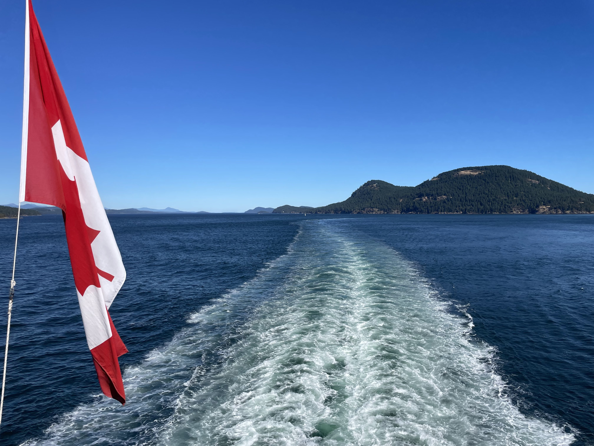
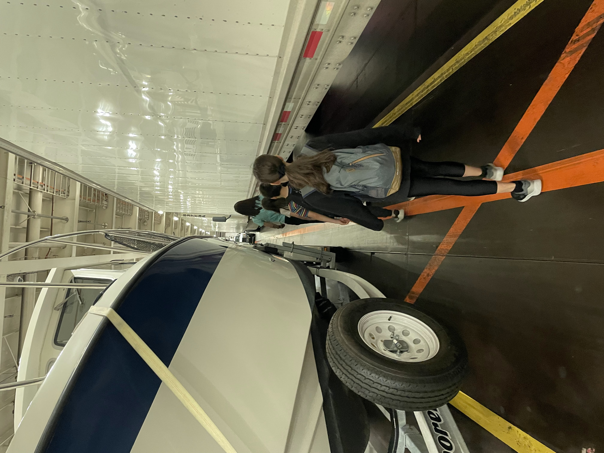
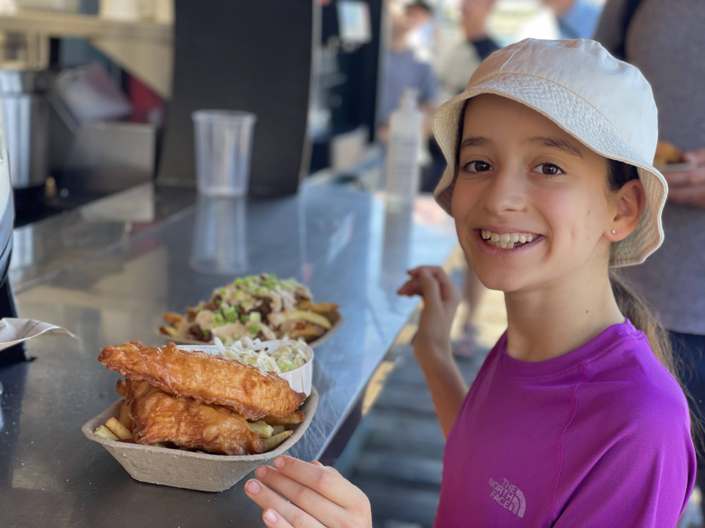
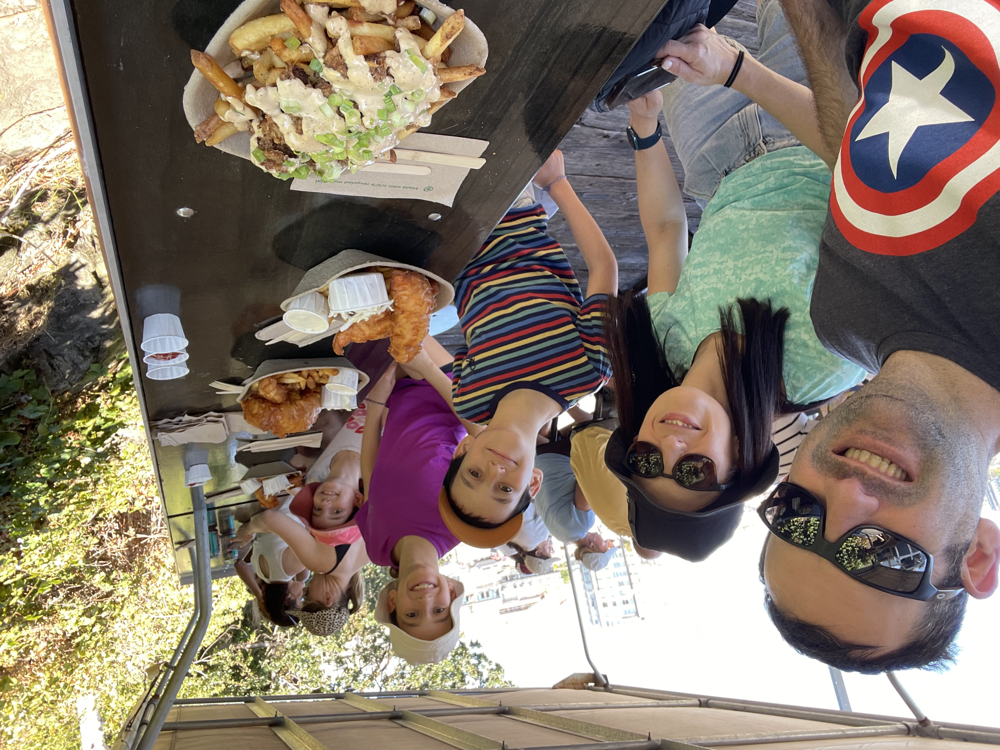
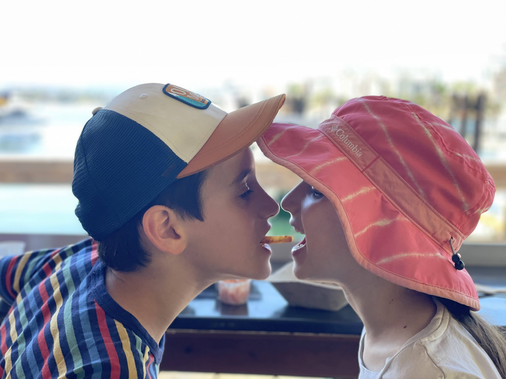

לפני שמחזירים את הקראוון תכננו להפליג לאי ונקובר ולטייל בעיר ויקטוריה ומשם להמשיך לשמורת הטבע Pacific Rim. המציאות הכתיבה לנו תוכנית אלטרנטיבית - אחרי ״גל החום״ הקצר שתקף את קנדה - התחזית לימים בהם תכננו לטייל בשמורה על שפת הים היתה ברורה - 100% גשם בכל שעות היום... חיכינו לראות אם משהו משתנה, אבל כל אתרי התחזיות הסכימו בנושא. את היומיים בהם תכננו לבלות בשמורה חילקנו בין עוד יום בויקטוריה ועוד יום בונקובר.

 אמנם האי ונקובר נחשב לאחד המקומות היציבים וקייציים בקנדה, בשנים האחרונות, עם השתנות האקלים קרו כמה ארועי מזג אוויר קיצוניים לכל הכיוונים - גלי של 50 מעלות בהם נהרגו אנשים, ומהצד השני שטפונות. בדיעבד גילינו, שבנוסף לגשם השוטף, ביום בו תכננו לחזור מהשמורה התפשטה שריפה עצומה בכל האזור שהיתה משבשת לנו את הנסיעה חזרה. קשה להתעלם מהעובדה שלאן שלא מסתכלים - האקלים משתגע לגמרי.

האי ונקובר הוא אמנם אי, אבל הוא גדול יותר מישראל וגרים בו כמיליון איש. לקחנו את המעבורת והתמקמנו בחניון הלילה Fort Victoria, משם התניידנו לויקטוריה באמצעות אוטובוסים בכל יום.

 העיר היפייפיה שוכנת על הים ומרגישה כמו סניף אירופאי קטן בקנדה. בהיותה הבירה של פרובינציית ״בריטיש קולומביה״ יש בה איזשהו ״וייב״ בריטי ואפילו מקומות שמתהדרים בTea time מלכותי. את הביקור בעיר התחלנו בסעודה בריטית-קנדית בדוכן פיש אנד צ׳יפס הפופולארי Red Fish Blue Fish על המזח. מלבד הפיש אנד צ׳יפס הרגיל טעמנו לראשונה את הPoutine המפורסם של קנדה. הקנדים, שממש לא מצטיינים בשום אספקט קולינרי פשוט זורקים גבינה ורוטב בשרי מצומצם על צ׳יפס ומלקקים את האצבעות. האוכל אמנם לא היה מקורי, אבל ממש טעים - לא לפספס. הגענו רעבים מידי והתחזרנו קצת יותר מידי עם הצ׳יפס

מטוסים - באמת

צ׳יינה טאון הכי ישן

גגג