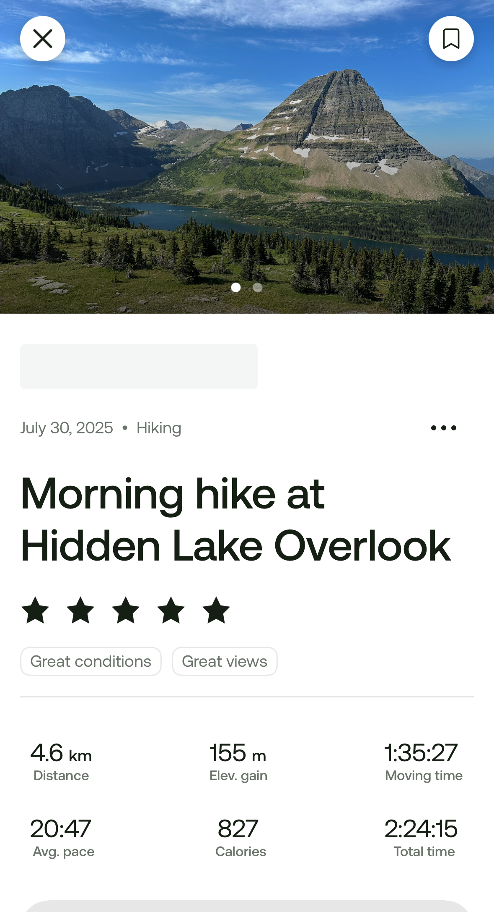

עבור היום האחרון בגליישר בחרנו במסלול המטפס לתצפית על Hidden lake. מסלול קל וקצר שבשונה מהמסלולים הקודמים שעשינו בשמורה, עובר בשטחים פתוחים ומטפס לתצפית.

שוב הגענו למרכז המבקרים כדי לתפוס את השאטל למסלול. למרות שהגענו הבה לפני 8, היה בתחנה של השאטל תור ארוך. אנשים, מסתבר, חיכו שם כבר מ6:30. כשהגיע האחראי על ההסעות, הוא בישר לנו שנהג אחד הבריז לו, ויש רק אוטובוס אחד, כך שמי שלא יכנס, יאלץ להמתין לא מעט להסעה הבאה. כדי להוסיף חטא לאיוולת, ה״סדרן המלומד״ התעקש שלמרות שהתור התארגן אחרי מי שהגיע מוקדם, הדרך הנכונה לעמוד בתור היא בכיוון ההפוך, ולכן מי שהגיע אחרון יכנס לאוטובוס ראשון. גם המחאות של האנשים בתור לא עזרו, וסדרן איים שאם נהפוך את הסדר הוא לא יעלה אותם לאוטובוס. הילדים קיבלו הצצה לעולמם של האמריקאים שמצייתים ציות עיוור לכללים, וגם למבוגרים עם ״טיפשות כללית״.  כשהגיע הנהג, הוא היה קצת יותר גמיש והסכים לדחוס באוטובוס אנשים בעמידה ולהושיב ילדים על הברכיים של ההורים כך שנכנסו בשאטל הקטן מעל 50 אנשים.

<figure class="centered-img">  
    
  <figcaption>נדחסים בשאטל של גליישר</figcaption>  
</figure>

זוג אמריקאים נחמדים ממינסוטה נתנו לילדים לשבת במקומם, ויצאנו לדרך! השאטל נוסע בכביש שנקרא "Going to the sun", ונסלל במשך יותר מעשור לפני בדיוק 100 שנה כדי לאפשר למטיילים להגיע לתוך השמורה. הנופים הנחשפים בנסיעה עצמה מרשימים ביותר. במהלך הנסיעה הנהג האט, וממש בסמוך לכביש חלפנו על פני דב שחור עומד על רגליו האחוריות ומנשנש משהו (לצערי לא הספקתי לצלם).

יצאנו לדרך! המסלול התחיל בטיפוס קליל על על גשרי עץ מוגבהים (בטענה שזה עוזר איכשהו לצמחיה להתחדש), אלכס התלוננה שזה ״לא מרגיש כמו טיול״, אבל די מהר גשרוני העץ הסתיימו ואפשר היה ללכת בטבע. 

<figure class="centered-img">  
    
  <figcaption>מתחילים במסלול</figcaption>  
</figure>

<figure class="centered-img">  
    
  <figcaption></figcaption>  
</figure>

<figure class="centered-img">  
    
  <figcaption></figcaption>  
</figure>

<figure class="centered-img">  
    
  <figcaption></figcaption>  
</figure>

הנופים הפנוראמיים של האחו הפתוח היו יפים והיווי גיוון מרענן. ולאורך המסלול טיילו מרמיטות שמידי פעם הציצו מידי פעם מהמחילות שלהן ולשרון לעוברים ושבים. על השביל פגשנו גם פנים אל פנים את עזי ההרים. עזי ההרים, האנדמיות להרי הרוקי, אמנם גדולות, חזקות ומצויידות בקרניים חדות, לא נחשבות מסוכנות בדרך כלל למטיילים ונחשבות לקמע של גליישר.

<figure class="centered-img">  
    
  <figcaption>עז הרי הרוקי</figcaption>  
</figure>

<figure class="centered-img">  
    
  <figcaption>עז הרי הרוקי</figcaption>  
</figure>

<figure class="centered-img">  
    
  <figcaption></figcaption>  
</figure>

<figure class="centered-img">  
    
  <figcaption></figcaption>  
</figure>

<figure class="centered-img">  
    
  <figcaption></figcaption>  
</figure>

המסלול הקליל מסתיים בתצפית ל״אגם החבוי״ (Hidden lake). מי שרוצה להאריך יכול גם להמשיך עד האגם עצמו, אבל בחרנו ביום רגוע, עשינו ועוד נעשה מסלולים מאמצים יותר. בתצפית, אנשים עם משקפות רציניות השקיפו על דובי גריזלי בצידו השני של האגם, אבל למרות שהבאנו משקפת קטנטנה, לא יכולנו לראות כלום. עדיין ״חייבים לנו״ דוב! אחרי נשנושים בתצפית, חזרנו באותה הדרך. עצרנו קצת להשתולל בגוש שלג שטרם הפשיר. 

<figure class="centered-img">  
    
  <figcaption>Hidden lake</figcaption>  
</figure>

<figure class="centered-img">  
    
  <figcaption></figcaption>  
</figure>

<figure class="centered-img">  
    
  <figcaption></figcaption>  
</figure>

<figure class="centered-img">  
    
  <figcaption></figcaption>  
</figure>

<figure class="centered-img">  
    
  <figcaption></figcaption>  
</figure>

<figure class="centered-img">  
    
  <figcaption></figcaption>  
</figure>

<figure class="centered-img">  
    
  <figcaption></figcaption>  
</figure>

<figure class="centered-img">  
    
  <figcaption></figcaption>  
</figure>

<figure class="centered-img">  
    
  <figcaption></figcaption>  
</figure>

חזרנו מוקדם לחניון הלילה לאחר צהריים רגוע יחד. מאד השתדלנו לרווח את הימים כך שישאר לנו זמן משפחתי רגוע. לשחק ביחד, לקרוא, וללמוד יחד לנגן ב״כלי נגינה של שטח״ שקנינו לטיול.

אחד הדברים שאני אוהב בטיול ארוך בקראוון, הוא שמ״בלי להתכוון״, הילדים לומדים כל כך הרבה דברים שימושיים על החיים. בעוד ביום-יום אנחנו ״מסתירים״ מהם הרבה מהדברים ש״קורים ברקע״ שמאפשרים את החיים, בקראוון הכל ״שקוף״. הילדים שותפים במידה רבה לקניות, בישולים, שטיפת כלים, כביסות, התלבטויות הטיול וכל מיני מנהלות שהם אפילו לא ידעו שקיימות. אפשר לומר שטיול בקראוון הוא ״מיקרו קוסמוס״ לחיי משפחה. אני ממש נהנה לשמוע את השאלות שלהם, להתייעץ איתם ולדבר על למה דברים הם כמו שהם. לנו ה״מבוגרים״ יש המון הרגלים אוטומטיים שאנחנו אפילו לא שמים אליהם לב, לפעמים אפשר ללמוד מהילדים ולנסות דברים חדשים במשפחה.

 הספקנו גם לעשות ״מסיבת כביסה״ ולהכין עוד ״ארוחת ערב אמריקאית קלאסית״ - והפעם - מק אנד צ׳יז זול מקופסא. בעוד בבית אנחנו מכינים גרסאות מושקעות (וכמובן בריאות יותר) של המאכלים, נחמד גם לתת לילדים לטעום את הגרסאות המקוריות אותן הם רואים בסדרות ובסרטים האמריקאים

<figure class="centered-img">  
    
  <figcaption>Take it easy Nemala</figcaption>  
</figure>

<figure class="centered-img">  
    
  <figcaption>מסיבת כביסה</figcaption>  
</figure>

<figure class="centered-img">  
    
  <figcaption></figcaption>  
</figure>

<figure class="centered-img">  
    
  <figcaption>RV Jamming</figcaption>  
</figure>

<figure class="centered-img">  
    
  <figcaption>קלאסיקה אמריקאית</figcaption>  
</figure>

<figure class="centered-img">  
    
  <figcaption></figcaption>  
</figure>

<figure class="centered-img">  
    
  <figcaption>השתחוו בפני הוד הפיכותו</figcaption>  
</figure>

<figure class="centered-img">  
    
  <figcaption>קינוח מושלם עם כל המרקמים שזכה ל״ביקור״</figcaption>  
</figure>

<figure class="centered-img">  
    
  <figcaption>לילה טוב פיטים</figcaption>  
</figure>

<figure class="centered-img">  
    
  <figcaption>לילה טוב עלמה שרלוט</figcaption>  
</figure>

<figure class="centered-img">  
    
  <figcaption>לילה טוב הורים</figcaption>  
</figure>

למחרת בבוקר נוסעים לבאנף. גם הבוקר לא מיהרנו ונתנו לילדים לישון עד מאוחר. בעוד במסך הגדול והקטן הילדים צורכים בעיקר תרבות אמריקאית, בקריאה של ספרות קלאסית בעיקר יצא שהילדים קראו סופרים אנגלים. כשיש זמן, או חגיגה מיוחדת, הילדים אוהבים להכין ״ארוחת בוקר כמו מלכת אנגליה״. וכך היה. ללא ספק פארק גליישר יזכר לטובה בפרקי ימי המשפחה. מחר יוצאים לכיוון באנף!

<figure class="centered-img">  
    
  <figcaption>עלמה שרלוט ״המלכה המבשלת״</figcaption>  
</figure>

<figure class="centered-img">  
    
  <figcaption></figcaption>  
</figure>

<figure class="centered-img">  
    
  <figcaption></figcaption>  
</figure>

<figure class="centered-img">  
    
  <figcaption></figcaption>  
</figure>
