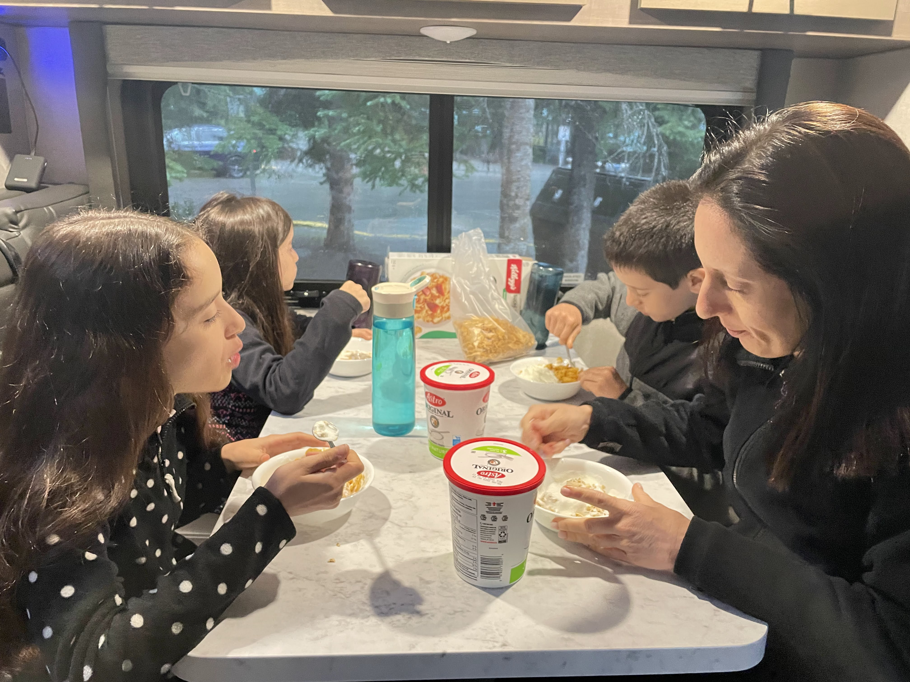
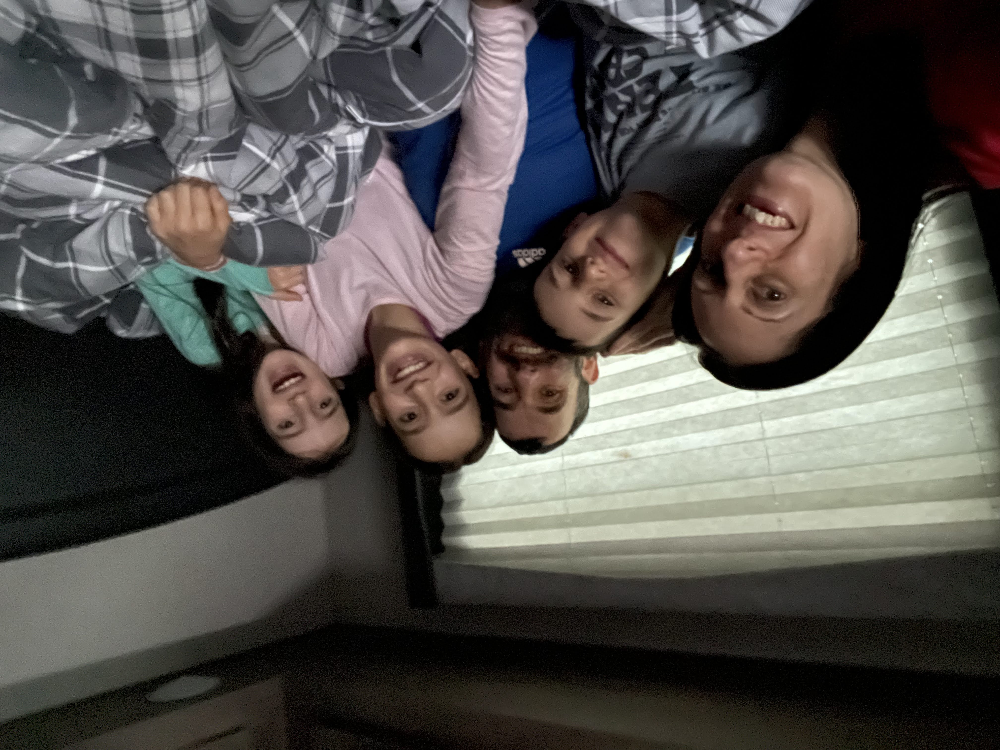

הבוקר חזרנו להשכים קום, נתחיל את המצע שלנו צפונה דרך ״אגם האיזמרגד״ (Emerald lake) שבפארק הלאומי יוהו (Yoho). בחניון האגם מספר מאד מוגבל של מקומות חניה, אז נאלצנו לצאת מוקדם מאד כי היתה לנו גם שעה נסיעה. התוכנית היתה לאכול את ארוחת הבוקר בחניון ואז לצאת למסלול. כמו בכל בוקר, הילדים התעוררו לקול שריקת הקומקום ולריח חזק של קפה נמס Tim Hortons.

<figure class="centered-img">  
    
  <figcaption>השכמה! טו טו טו</figcaption>  
</figure>

עד כה מזג האוויר היה מושלם, וגם אם היה קצת גשם הוא תמיד הגיע אחר הצהריים המאוחרים כשסיימנו כבר את הפעילויות שלנו בחוץ. הבוקר היה שונה - התחזית דיווחה על סופות וגשמים בבוקר והתבהרות בהמשך היום. כבר מוקדם מאד בבוקר ראינו שהשמיים כהים מאוד. לא שהייתה לנו יותר מידי ברירה - אבל החלטנו לנסוע לחניון, לאכול, להתארגן ולראות ״מה קורה״. עד שהגענו כבר היה מבול משוגע. בנוסף, אפילו לא היה לנו מקום לחנות את הקראוון. החלטנו ״להתעלם מהעובדות״ ולאכול ארוחת בוקר בקראוון בצד הכביש.

<figure class="centered-img">  
    
  <figcaption>ארוחת בוקר חורפית</figcaption>  
</figure>

סיימנו את ארוחת הבוקר, כשבחוץ עדיין מבול. אחד הקראוונים שחנו בחניון התייאש ממזג האוויר והמשיך הלאה - מהר תפסנו את מקום החניה היחיד - בעיה אחת נפתרה... החלטנו לתת לתוכנית עוד צ׳אנס, במקום לדלג על המסלול ולנסוע לחניון, החלטנו להשאר ולהעביר את ההקרנה המשפחתית מהערב לבוקר. כשיש לנו שעה פנויה בל״וז אנחנו רואים סדרה משותפת. לטיול לקנדה לקחנו את ״חומריו האפלים״ (his dark materials) של פיליפ פולמן. עד כה, עמוק לתוך העונה הראשונה, מאד התחברנו לסדרה - מתעסקת בהרבה נושאים שקרובים לליבי - ילדות, התבגרות וחוליי המימסד הדתי. הסידרה אמנם לא קשורה לקנדה, אבל בהחלט יש בה דובים! החסרון היחיד הוא שלא קראנו את הספרים... אבל נאלץ לתקן בדיעבד... חיברנו רמקולים, העברנו את הקראוון למצב ״קולנוע ביתי״ ושקענו לפרק מותח.

<figure class="centered-img">  
    
  <figcaption>התכרבלות חורפית</figcaption>  
</figure>

כפי שחזתה התחזית, לאחר שעה של צפיה הגשם פסק, השמיים עדיין היו מעוננים, אבל זה כבר נראה הרבה יותר טוב. ארזנו מעילי גשם, התארגנו ויצאנו לדרך!

בעיקר מנהלתית - לא חלק מבאנף כי בבריטיש קולומביה, וגם גאוגרפית חצויה

שם הפארק - קריאת התפעלות בשפת הקרי הילידית הקנדית

הגרלה - אגם אוהרה - היה פעם ״סוד של מטיילים״, נהיה עמוס ולא כיף - פקקים - עצרו את החגיגה

4 עונות ביום אחד, נס האש ששרדה את הגשם

צעדת הגשם

קרחון

אתה באסקה - את טונה

קנדי עם מקל הוקי

1844 עצים מעוקמים עם מזל

בודקים אופציה לסירה - שינוי אקלים נוצר אגם סירה

עונתיות - גבעות קטנות

ראינו פאקינג דוב

קמפינג בלי כלום, נחמד, קדרה

טיול בדרך עם הטיפוס: מדרון חלקלק - מגוד מורנינג, דרך בונז׳ור, עד ל״מיאו עם קידה עמוקה״
