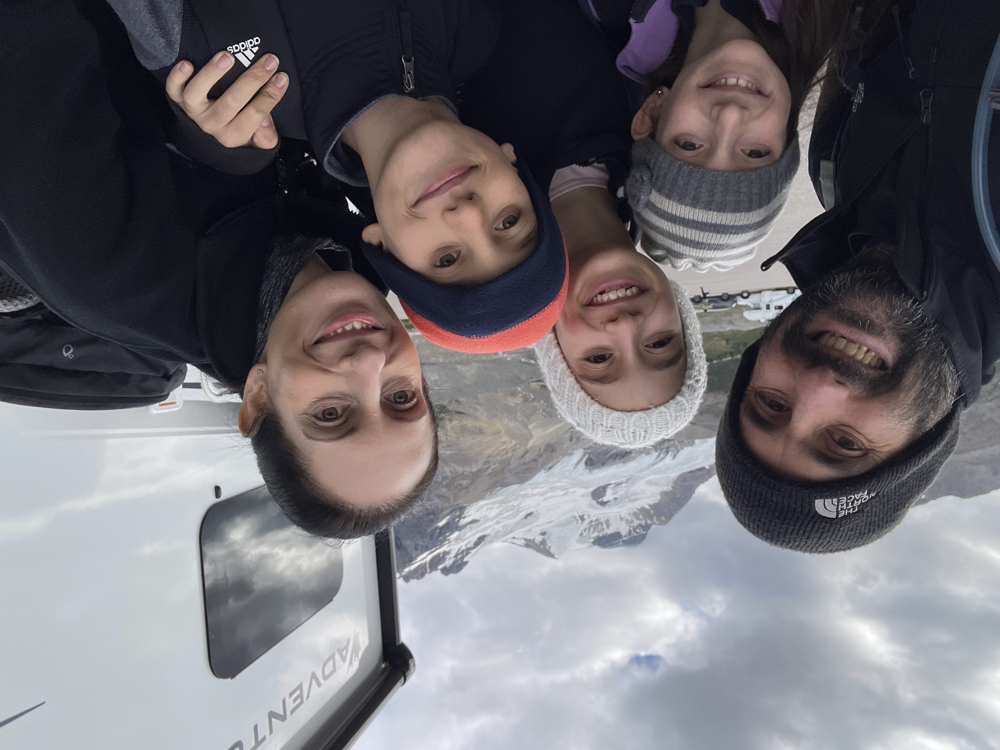
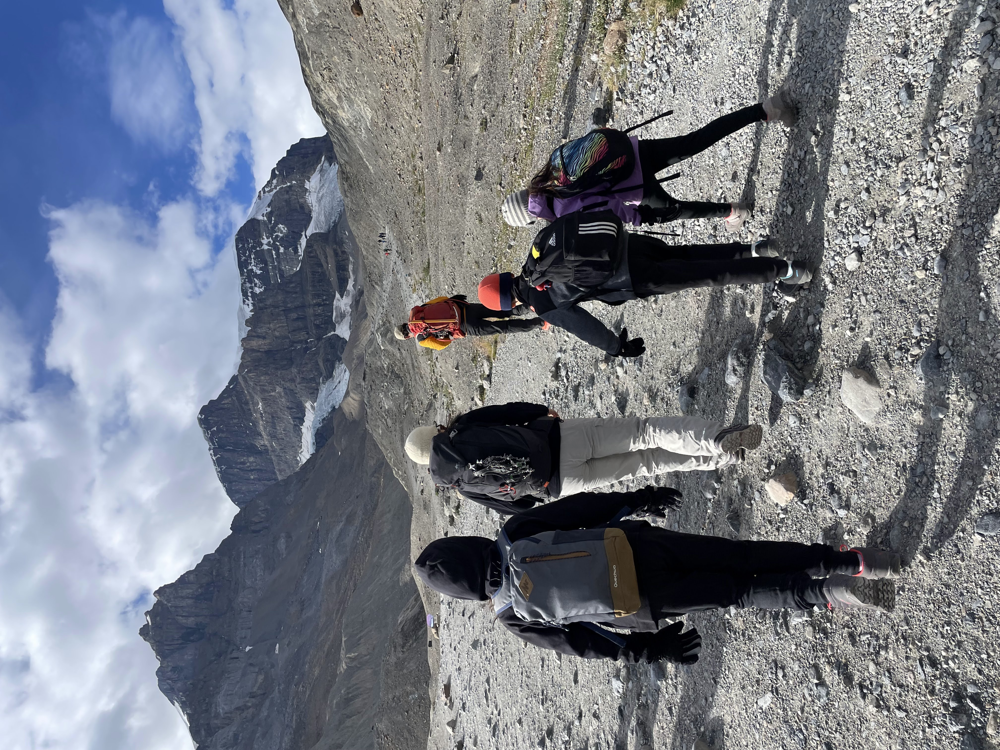
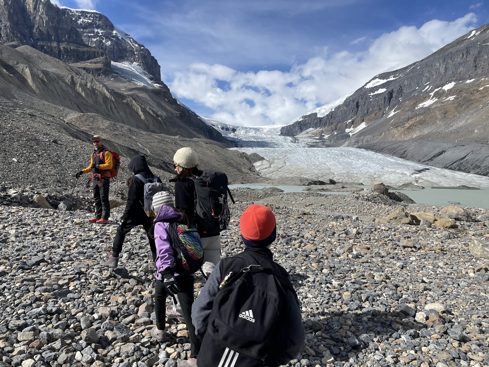
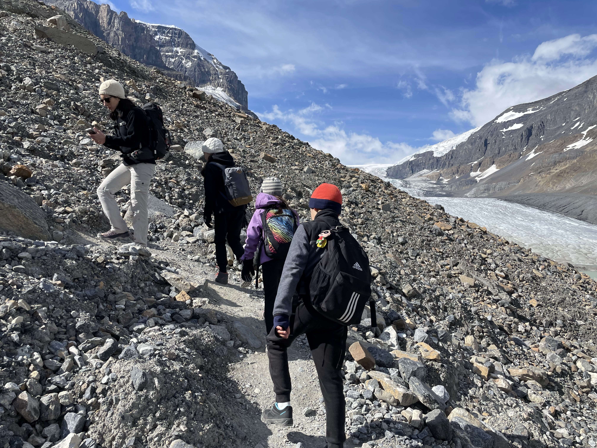
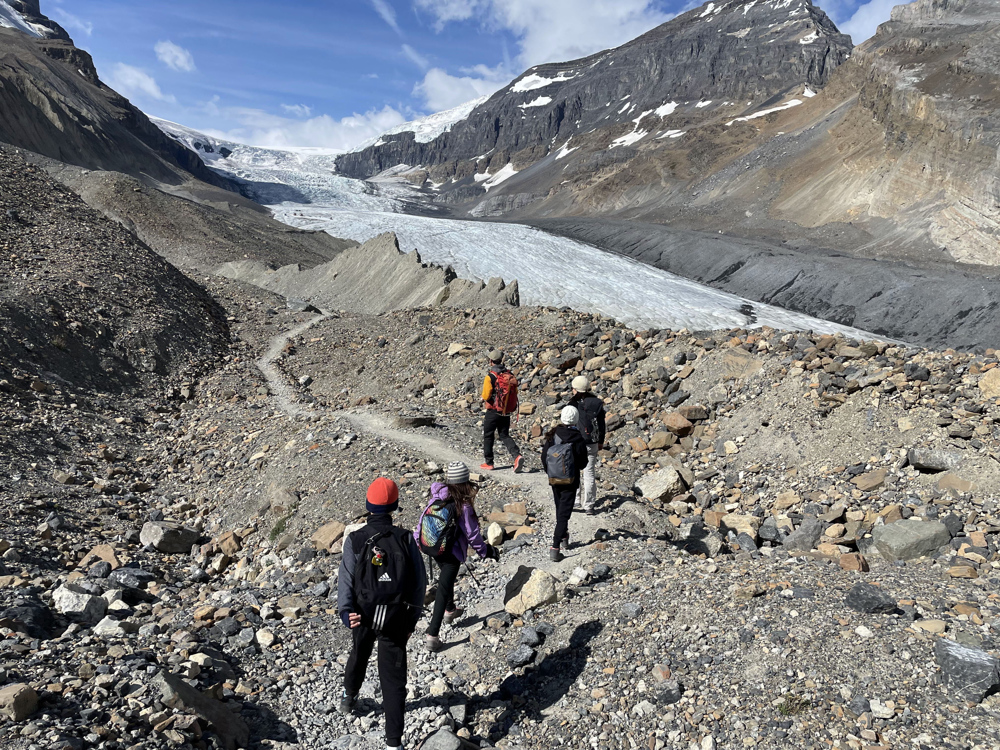
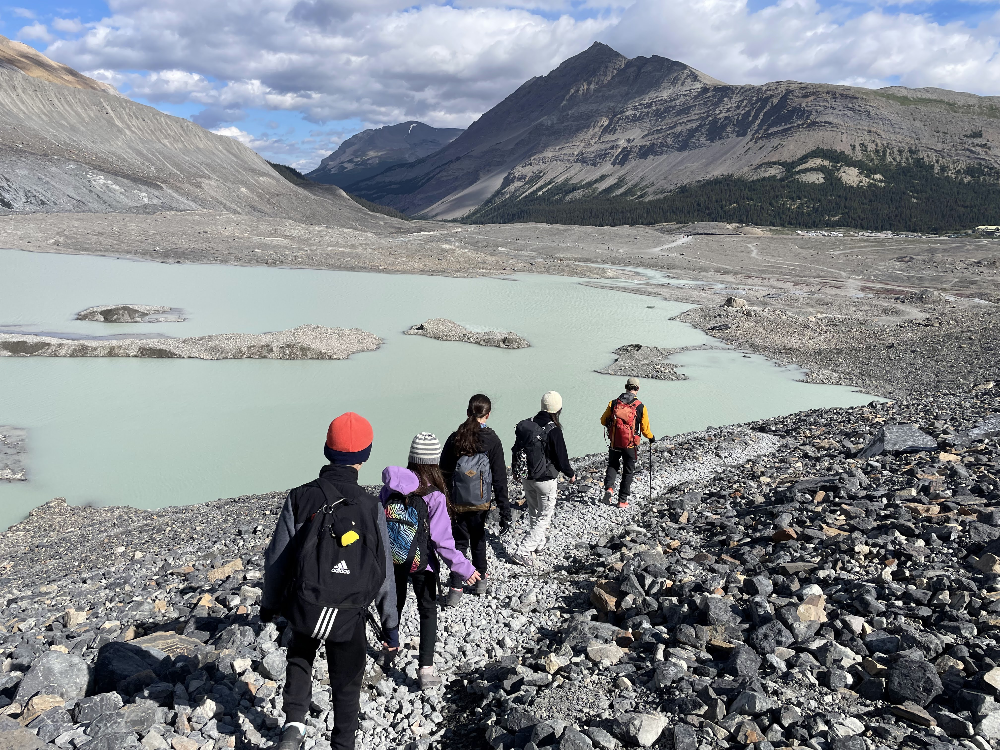

הבוקר שום קמנו מוקדם, עזבנו את חניון הלילה בשמורת יוהו ונסענו צפונה. הדרך המחברת את אגם לואיז בבאנף לג׳אספר נקרת ״דרך שדות הקרח״. התוכנית היומית כוללת טיפוס על קרחון אתבסקה (Athabasca). הקרחון הוא חלק משדה הקרח ״קולומביה״ ומאפשר גישה נוחה יחסית למטיילים לצפות בו מקרוב, או לטפס עליו עם ציוד מתאים והדרכה. אנחנו הזמנו טיפוס מודרך הכולל הליכה על הקרחון עצמו.

טיפ כללי חשוב - שמתי לב שבכל הפעמים בהן נסענו ליעד ורק אז אכלנו את ארוחת הבוקר, הנסיעה הרבה יותר שקטה, ילדים מורעבים שקטים יותר וחסרי אנרגיה - מומלץ מאד.

הקרחון עליו נטפס צפה עלינו מלמעלה ונראה בבירור ממגרש החניה. כבר בזמן ארוחת הבוקר הרגשנו שקפוא בחוץ. נוסף על כך, מזג האוויר היה מעונן מאד, אך התחזית היתה אופטימית. לבשנו עלינו את ציוד החורף ויצאנו אל הקור.

אספנו את הציוד, ואחרי תדריך בטיחות קצר והכרות עם המדריך יצאנו לדרך. השמיים התחילו להתבהר ויצאנו לכבוש את הקרחון!

<figure class="centered-img">  
    
  <figcaption>מוכנים ליציאה</figcaption>  
</figure>

<figure class="centered-img">  
    
  <figcaption>יוצאים לטיפוס</figcaption>  
</figure>

<figure class="centered-img">  
    
  <figcaption></figcaption>  
</figure>

<figure class="centered-img">  
    
  <figcaption></figcaption>  
</figure>

<figure class="centered-img">  
    
  <figcaption></figcaption>  
</figure>

ממגרש החניה, אוטובוס קטן לקח את הקבוצה לנקודת ההתחלה של הטיפוס. משם טיפסנו מסביב לאגם בשביל שהוביל אותנו למרגלות הקרחון. בדרך סיפר לנו המדריך את הסיפורים מרתקים על הדינאמיות של הקרחונים. כאשר החברה שלהם פתחה את הטיול הראשון לפני 40 שנה, הקרחון הגיע בדיוק לנקודה בה הוריד אותנו האוטובוס ומשם התחיל הטיפוס. מאז, בכל שנה, הקרחון נסוג במהירות מעריכית והמשימה להגיע אליו הולכת ומסתבכת. בכל תחילת עונה, מגיעים המדריכים למרגלות הקרחון ומחליטים איך יגיעו לשם הפעם. מסתבר שהאגם סביבו טיפסנו נוצר רק השנה, והפתיע את החברה כשהגיעו לשם בתחילת העונה. המדריך סיפר שלקח להם 4 ימים רק לחצוב בגרזנים את השביל מסביב לאגם כדי לאפשר את ההליכה.

<figure class="centered-img">  
    
  <figcaption>חדש - אגם בהתהוות</figcaption>  
</figure>

מעניין מה יהיה תוואי השטח, מומחים, סירה, מנסים 

קרחון קולומביה - שש אצבעות
נמס מאז 19

אתה באסקה - את טונה
קנדי עם מקל הוקי

1840 עצים מעוקמים עם מזל

בודקים אופציה לסירה - שינוי אקלים נוצר אגם סירה

עונתיות - גבעות קטנות

ראינו פאקינג דוב

קמפינג בלי כלום, נחמד, קדרה

טיול בדרך עם הטיפוס: מדרון חלקלק - מגוד מורנינג, דרך בונז׳ור, עד ל״מיאו עם קידה עמוקה״
