 את הבוקר פתחנו באתר הקמפינג הנחמד ביוהו. 

<figure class="centered-img">  
    
  <figcaption>השמש זורחת על יוהו</figcaption>  
</figure>

למה אני בחוץ בזריחה? אני לא, אני באוטו. את רוב הבלוג הזה כתבתי בשעות 5-6:30 בבוקר. במושב הקדמי של הקראוון בעוד המשפחה ישנה. למה אני ער בשעות הללו? לא ברור, זאת הכימיה שלי, קם ב5... לפחות מנסה לנצל את הזמן 😃

<figure class="centered-img">  
    
  <figcaption>בוקר טיפוסי בטיול שלי</figcaption>  
</figure>

<figure class="centered-img">  
    
  <figcaption>עכשיו כולם מתעוררים</figcaption>  
</figure>

<figure class="centered-img">  
    
  <figcaption>דמויות בלי תפקיד בבוקר</figcaption>  
</figure>

היום יסתיים המסע צפונה ונגיע לג׳אספר. בדרך עשינו את מסלול ההליכה [parker ridge](https://www.alltrails.com/trail/canada/alberta/wilcox-viewpoint-via-wilcox-pass). אמנם טכנית המסלול נמצא עדיין בגבולות הפארק באנף על גבול ג׳אספר, אני מתעלם מעובדה זו לחלוטין וכותב שהוא חלק מג׳אספר. הבוקר היה קר, כשהגענו לחניון של המסלול ירד גשם קל אז ב״נוהל״ ישבנו לצפות בסדרה שלנו. בעקבות המפגש עם הדב אתמול, התאים במיוחד הפרק בו צפינו היום בו כיכבו הרבה  דובים משוריינים.

<figure class="centered-img">  
    
  <figcaption>בפינת ה״קולנוע הביתי״</figcaption>  
</figure>

השמיים נראו עדיין מאיימים, אבל החלטנו ללכת על זה. ארזנו מעילי גשם ויצאנו לדרך. המסלול התחיל בטיפוס. המסלול לא ארוך אבל יש טיפוס שעזר לנו להתחמם בקור המקפיא. אחרי כמעט שעה נגלה בפנינו נוף דרמאטי אל קרחון ססקצ'ואן (Saskatchewan Glacier). בדומה לקרחון אתבאסקה עליו טיפסנו אתמול, גם ססקצ׳ואן הוא אחת ה ״אצבעות״ הנשפכות מ״שדה הקרח קולומביה״. הנוף המרשים היווה פרס הוגן בעבור הטיפוס הקצר

<figure class="centered-img">  
    
  <figcaption>טיפוס קור</figcaption>  
</figure>

<figure class="centered-img">  
    
  <figcaption></figcaption>  
</figure>

<figure class="centered-img">  
    
  <figcaption></figcaption>  
</figure>

<figure class="centered-img">  
    
  <figcaption>קרחון ססקצ'ואן נגלה בפנינו</figcaption>  
</figure>

מהנקודה בה ניתן לראות את הקרחון המסלול ממשיך מזרחה על צלע ההר. לקראת הסוף המסלול נהיה כבר מאד צר וקצת מסוכן, אבל אז נגמר בעוד נקודת תצפית ממנה התחלנו לחזור. נקודות התצפית על הקרחון לכל אורך הדרך מרהיבות. ניתן לראות בבירור את מסלול הקרחון המקורי ואת הנסיגה שלו - עוד עדות לעתיד לבוא. באינטרנט זמינות תמונות מ100 השנים האחרונות ואפשר ממש לראות את הנסיגה בבירור.

<figure class="centered-img">  
  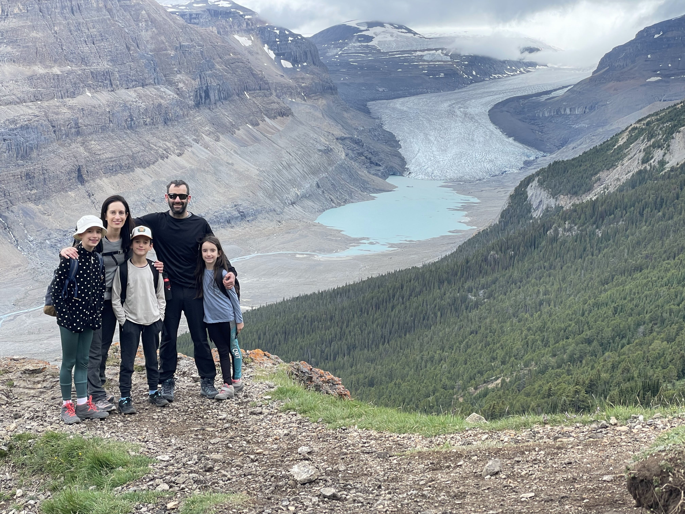  
  <figcaption></figcaption>  
</figure>

<figure class="centered-img">  
  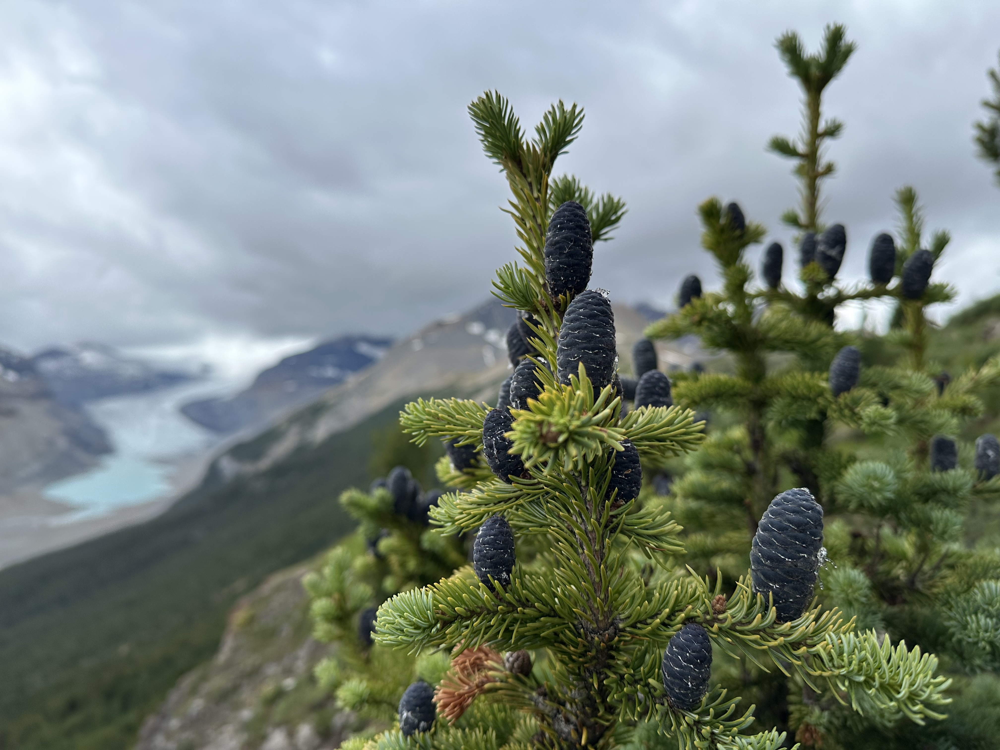  
  <figcaption></figcaption>  
</figure>

<figure class="centered-img">  
  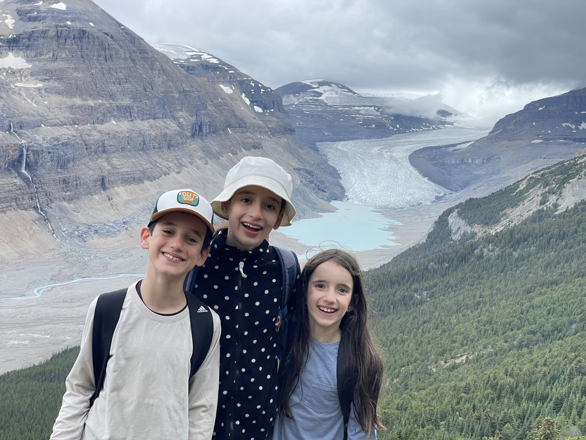  
  <figcaption></figcaption>  
</figure>

<figure class="centered-img">  
  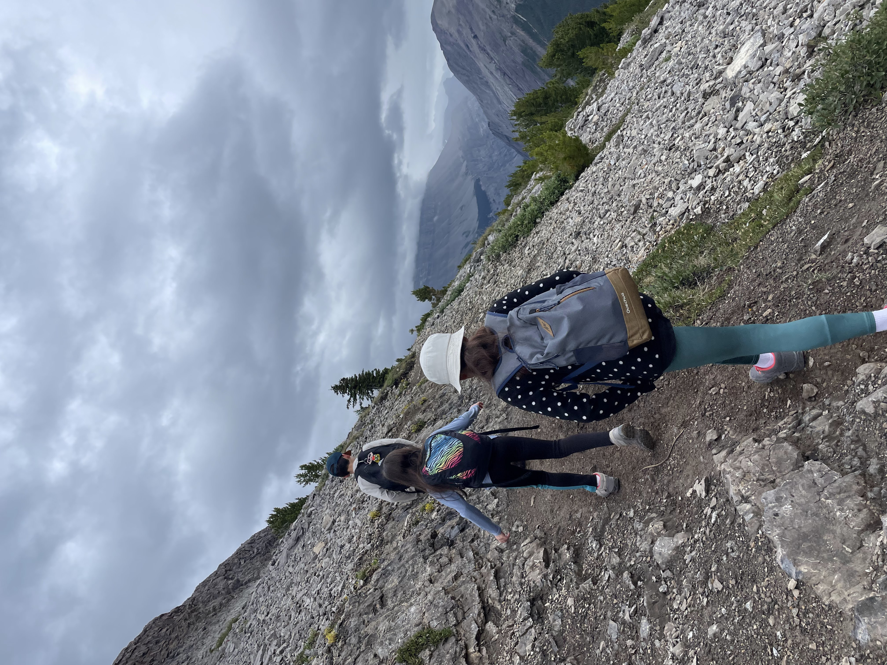  
  <figcaption></figcaption>  
</figure>
<figure class="centered-img">  
  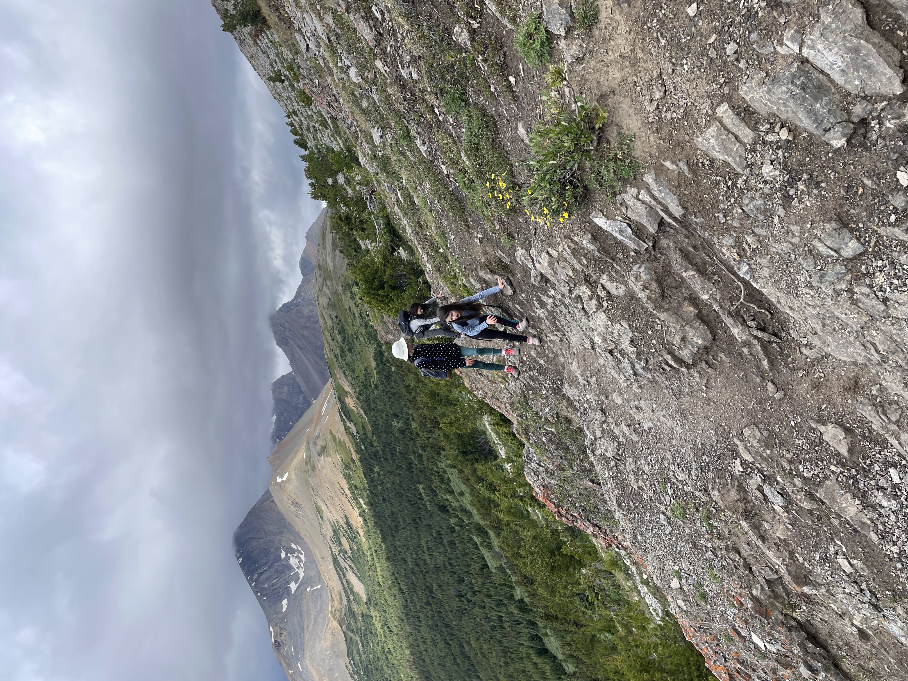  
  <figcaption></figcaption>  
</figure>
<figure class="centered-img">  
  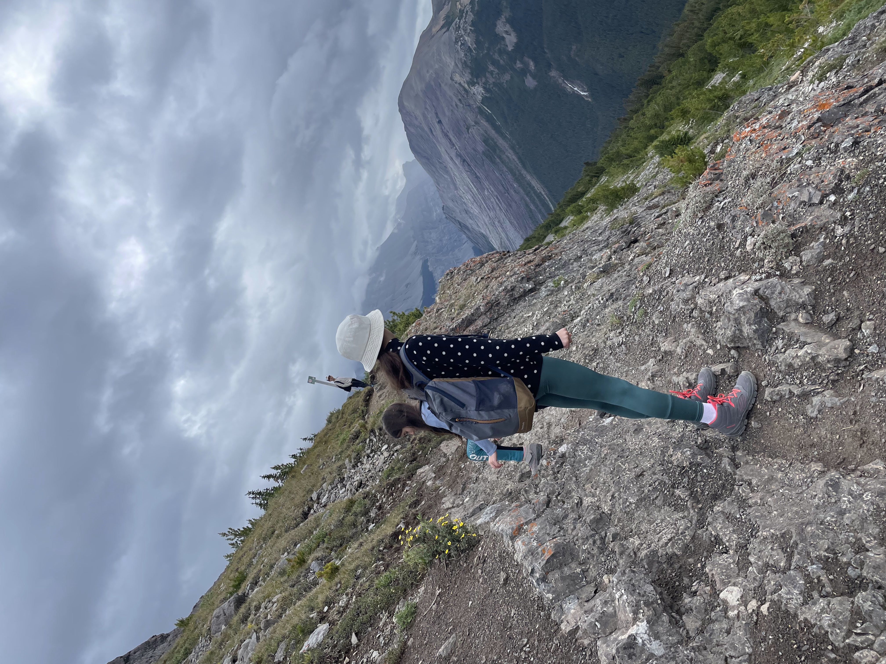  
  <figcaption></figcaption>  
</figure>
<figure class="centered-img">  
  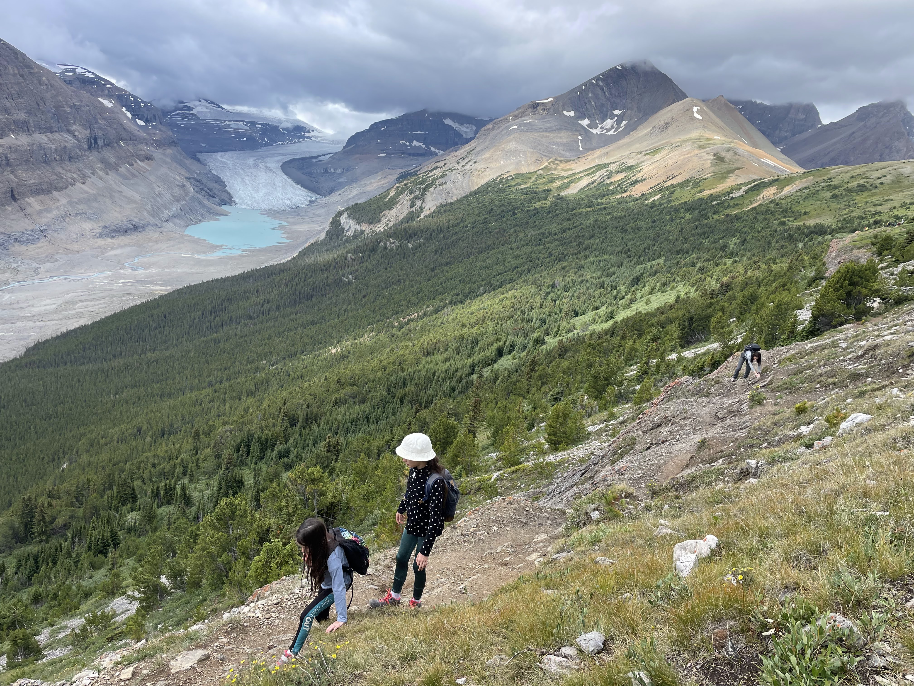  
  <figcaption></figcaption>  
</figure>
<figure class="centered-img">  
  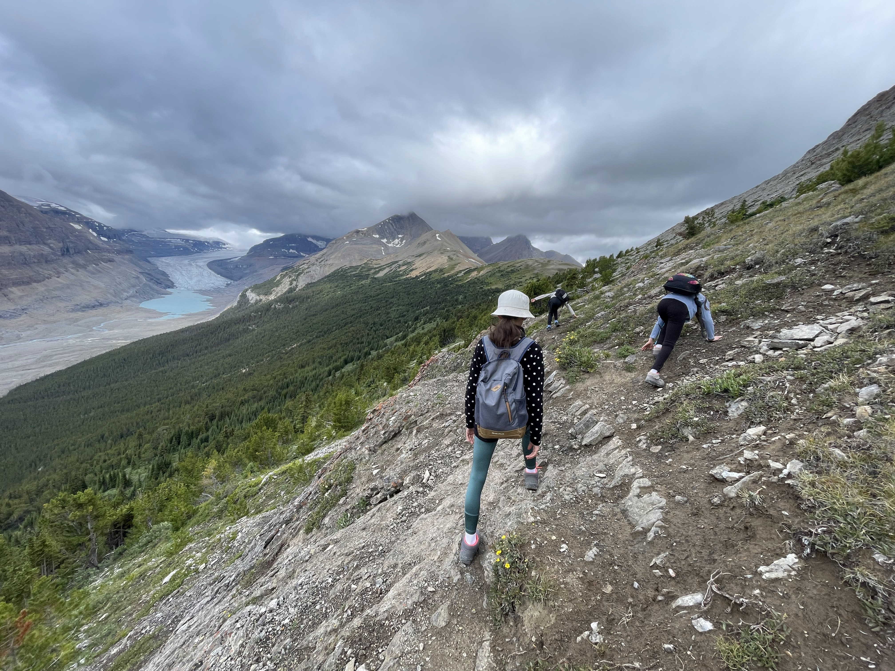  
  <figcaption></figcaption>  
</figure>

בדרך חזרה מזג האוויר התקדר ואיתו הקור. הנמלה לא התרשמה מהנבואה שדיברה על ירידה חלקלקה בגשם מלאת נפילות ועצמות מתפצפצות והכריחה אותנו לצאת לעוד ״טיפוס צד אחרון״. שרדנו את הטיפוס הלוך חזור ומיהרנו לרדת לפני שהנבואה האיומה תתגשם

<figure class="centered-img">  
  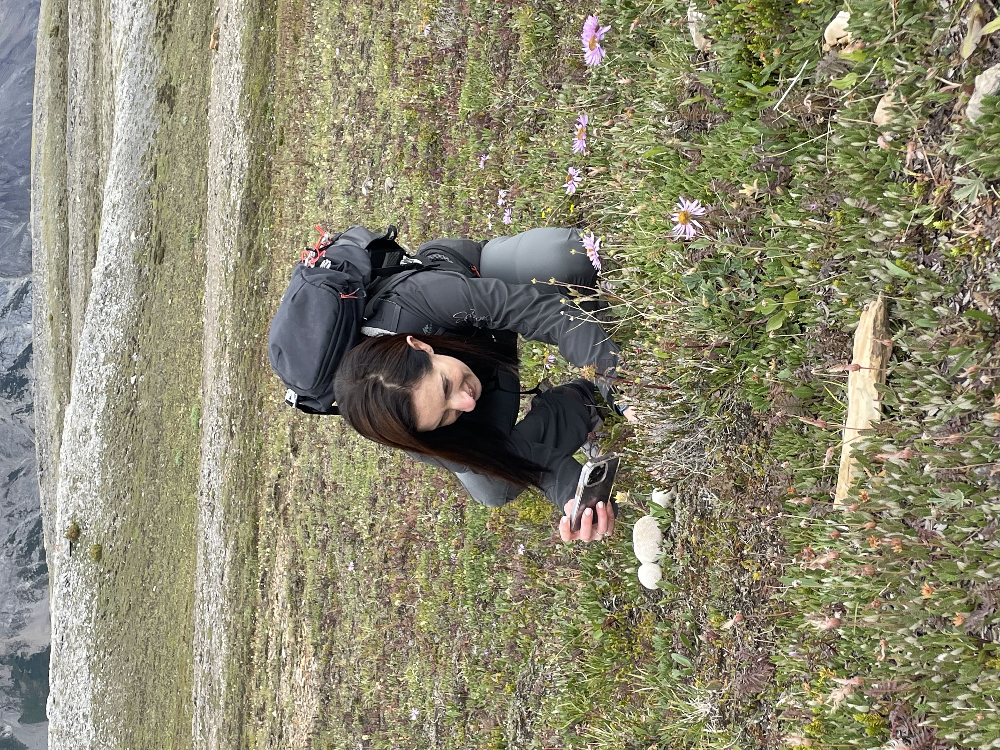  
  <figcaption>נמלת הרים בתנוחה אופיינית</figcaption>  
</figure>

<figure class="centered-img">  
  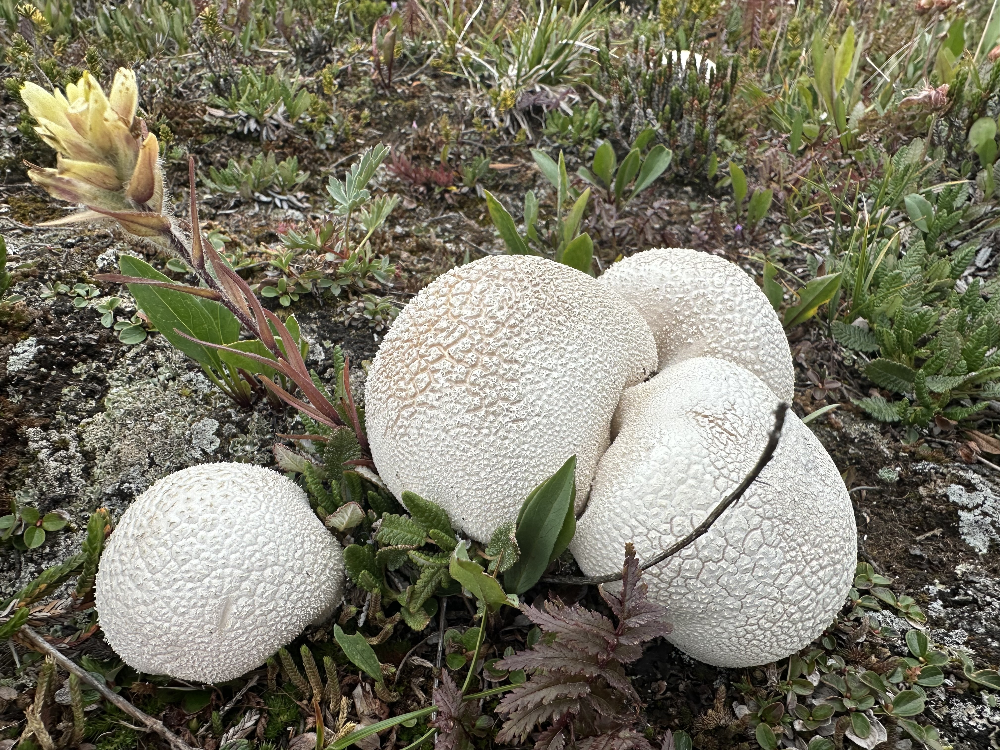  
  <figcaption></figcaption>  
</figure>

<figure class="centered-img">  
  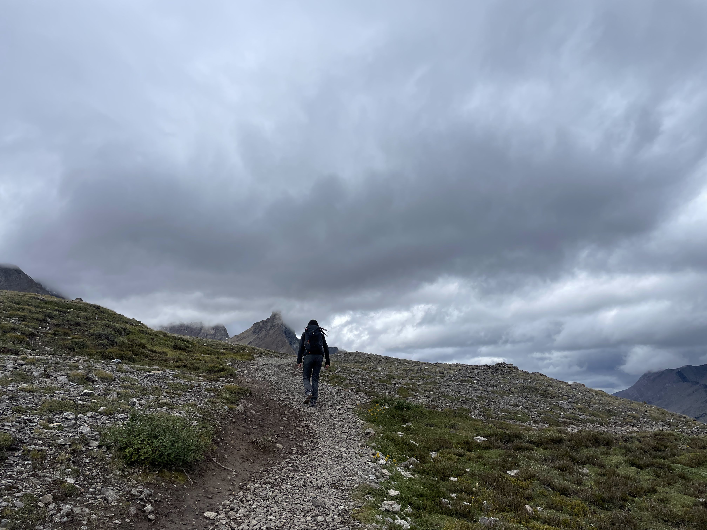  
  <figcaption>נמלה מתעלמת מה״נבואה״</figcaption>  
</figure>

<figure class="centered-img">  
  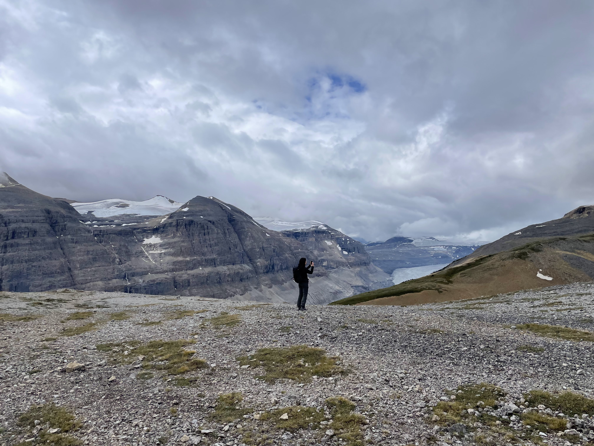  
  <figcaption>נמלה אצילית בפסגה</figcaption>  
</figure>

<figure class="centered-img">  
  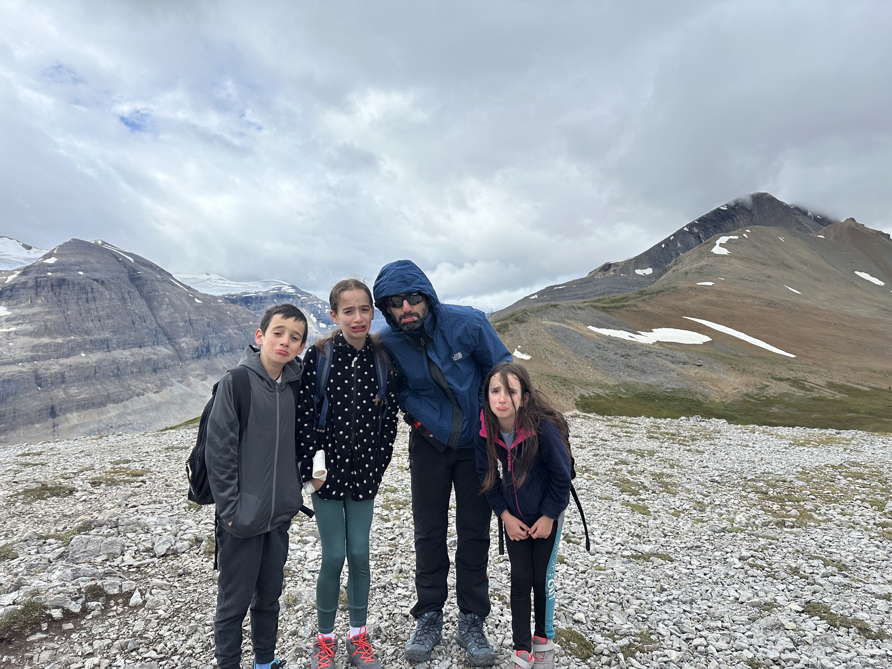  
  <figcaption>פשוטי העם קופאים ב״מסעות הנמלה״</figcaption>  
</figure>

<figure class="centered-img">  
  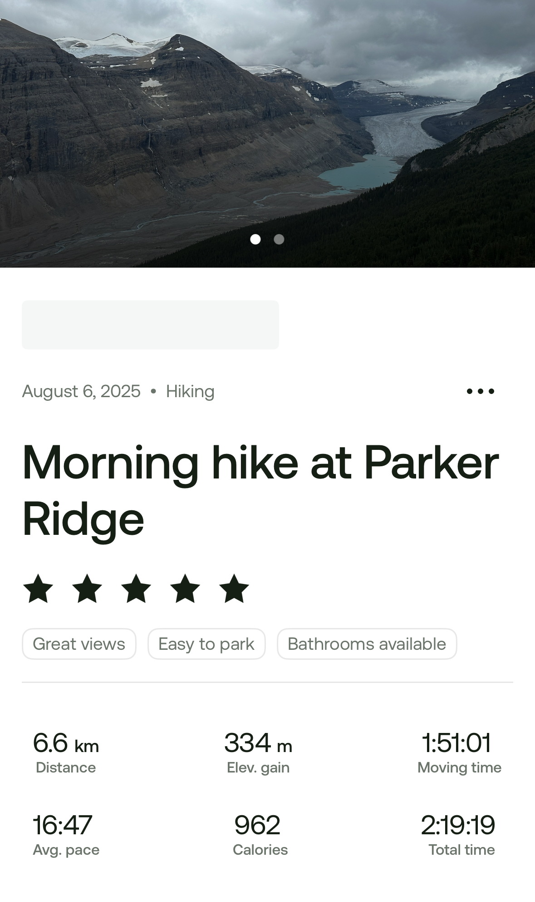  
  <figcaption></figcaption>  
</figure>

בירידה אמנם הנבואה לא התגשמה כפשוטה אבל כנראה שדברי מפלצת הספגטי לא ניתנים לפיענוח פשוט. הגשם אמנם חיכה עד שנגיע לקראוון, אך בדרך למטה אכן הגענו ל״מדרון חלקלק ביותר״ באופן מסויים. בטיול הראשון שלנו בקנדה, הכרחנו את אלכס לברך את המטיילים הבאים ממולנו ב״גוד מורנינג״ ברור וחזק. בהמשך הטיול ניסינו ברכות אחרות, אבל הפעם המדרון נהיה חלקלק ביותר לתוך תחום הלא סביר. התחלנו את הירידה כשאלכס צריכה לברך את העולים בברכת ״בונז׳ור״. משם זה המשיך ל״ברכת בונז׳ור עם מבטא צרפתי מוגזם ביותר״. השלב הבא היה ״בונז׳ור עם מבטא צרפתי מוגזם ביותר, ואחריו ׳צחוק צרפתי חסר מעצורים׳״. הירידה עברה מהר עם צחוקים רמים, אבל לא כאן זה נגמר, לא כך חזתה הנבואה - הטיול הסתיים כשהברכה לעולים האומללים הייתה: אלכס נעמדת מולם, יוצרת קשר עין ברור (עד כדי חוסמת את דרכם), נעצרת, ועושה ״מיאו״ ארוך, חזק, ברור ומוגזם תוך כריעה לקידה עמוקה. 😹 עולם הנבואות עמוק ומלא הפתעות.

todo:video

חזרנו לקראוון ונסענו לג׳אספר

todo:jasper

מעל שליש מהמבנים הושמדו

שלטים שרופים שלא שוקמו

שליש מהבתים נשרפו, כולל של ראש העיר וראש יחידת הכבאים
 קמפגראון נשרף לחלוטין
שילוב של כמה שריפות

קראוונים של המקומיים במקום הבתים!

מקלחות חדשות שיא הטכנולוגיה הקנדית

אנשים במשרד התיירות לא העפרון המחודד

<figure class="centered-img">  
  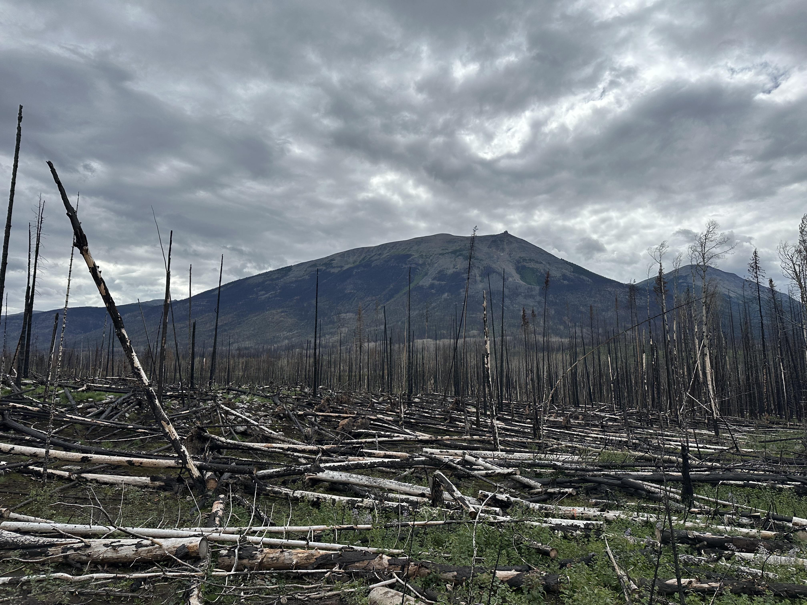  
  <figcaption></figcaption>  
</figure>
<figure class="centered-img">  
  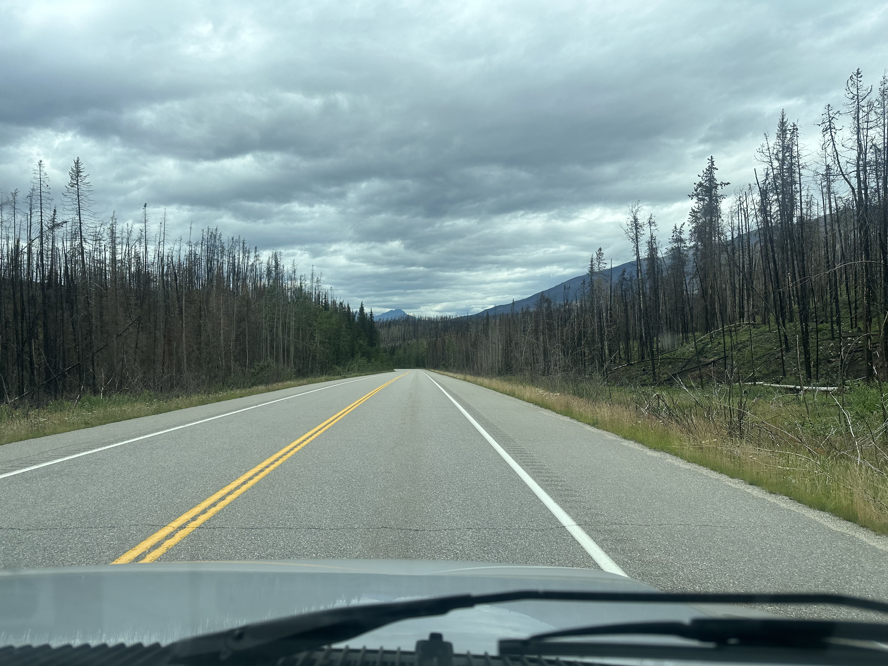  
  <figcaption></figcaption>  
</figure>

גגגגג