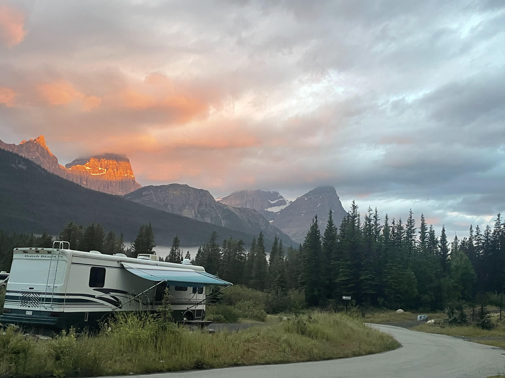
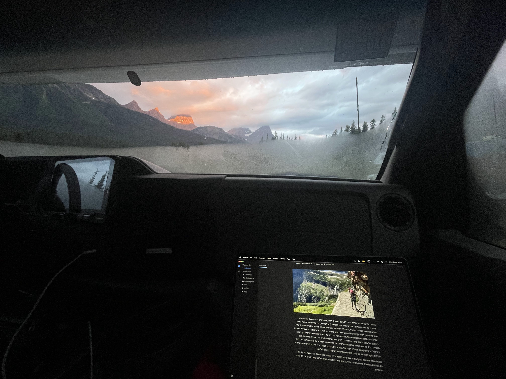
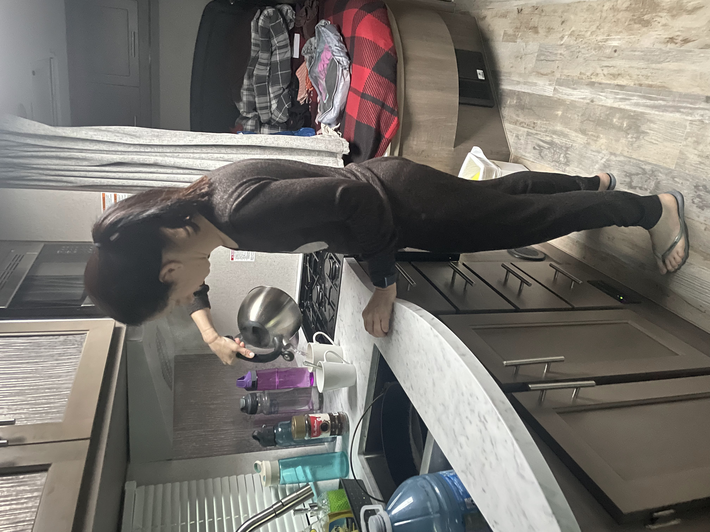
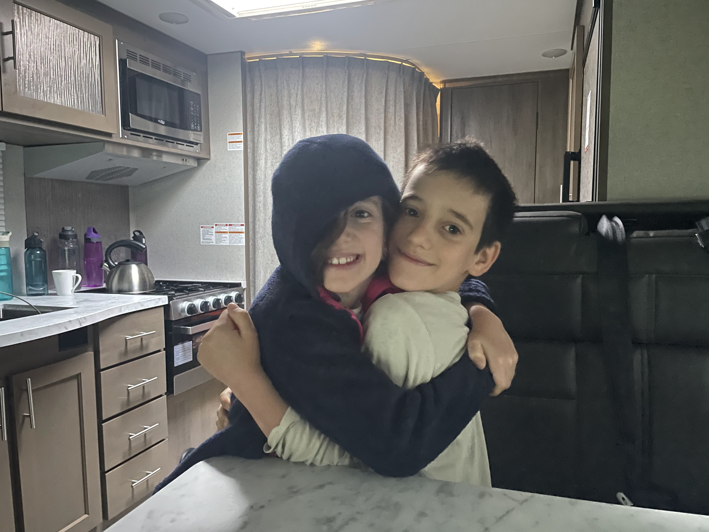
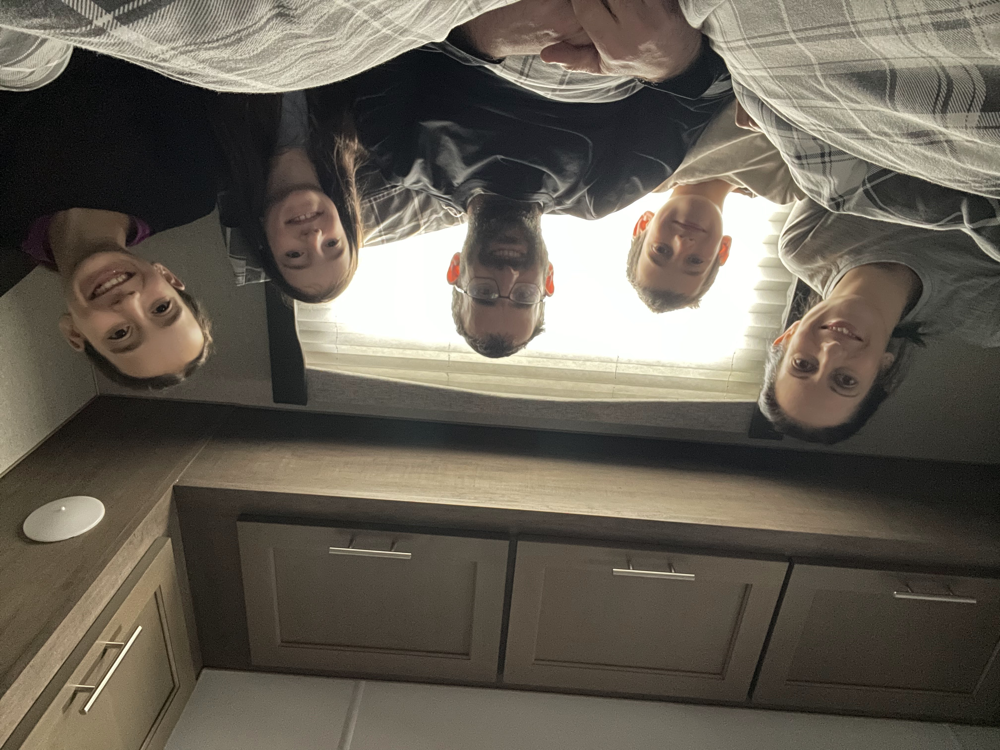
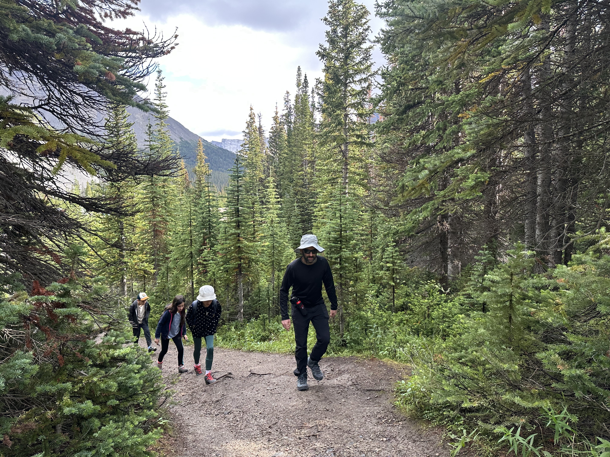
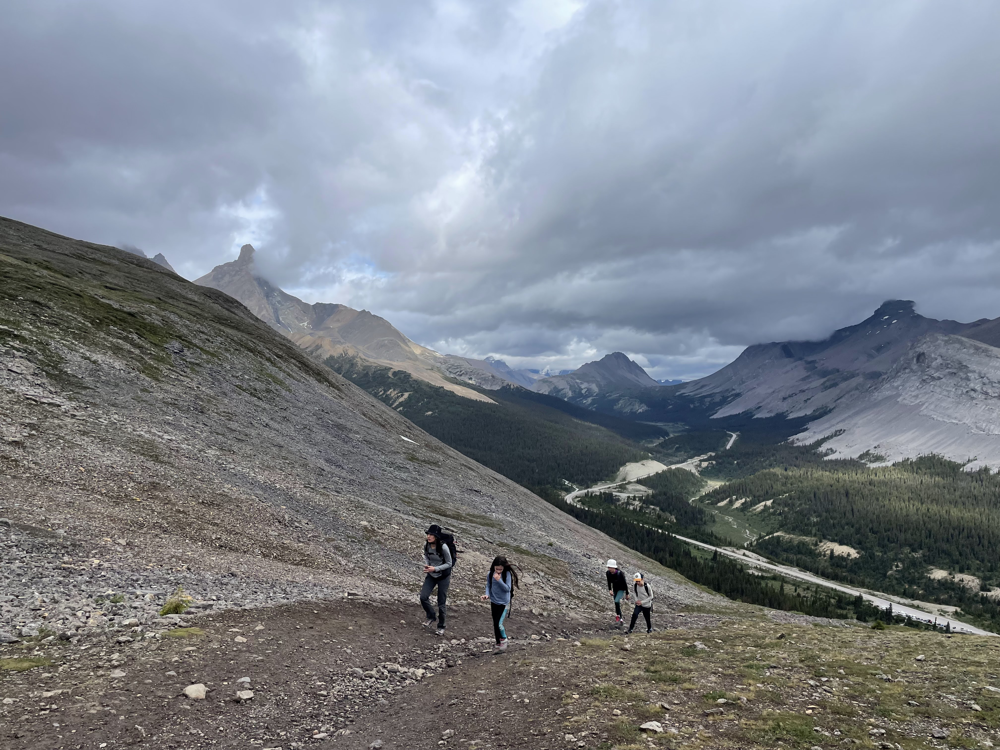
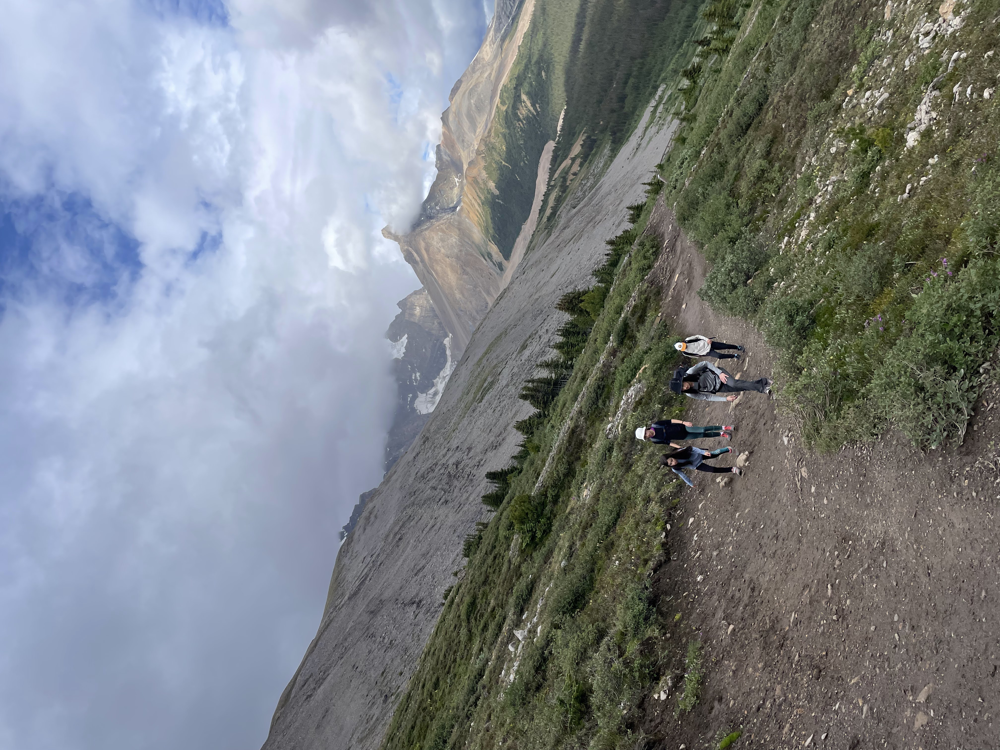
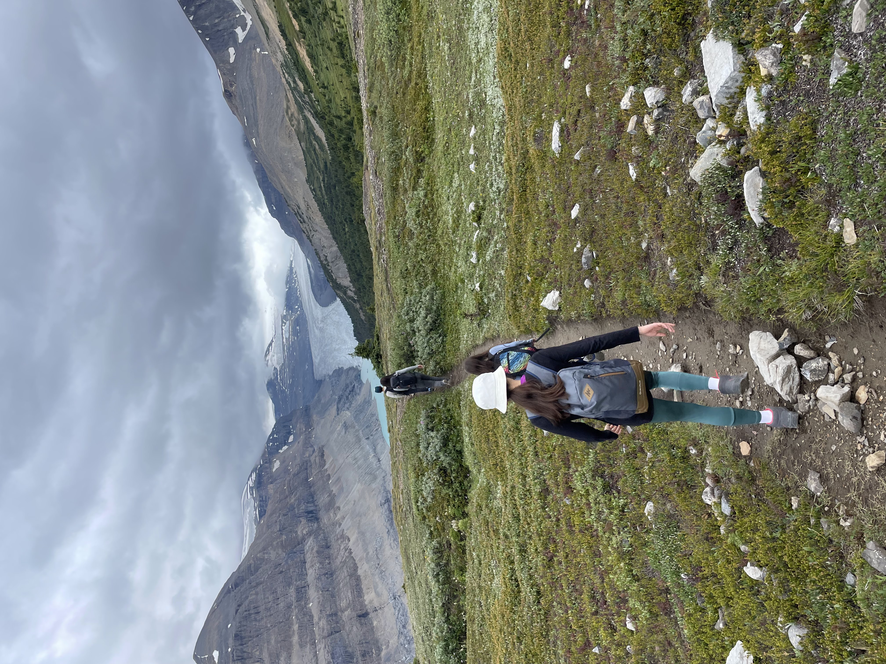

 את הבוקר פתחנו באתר הקמפינג הנחמד ביוהו. 

<figure class="centered-img">  
    
  <figcaption>השמש זורחת על יוהו</figcaption>  
</figure>

למה אני בחוץ בזריחה? אני לא, אני באוטו. את רוב הבלוג הזה כתבתי בשעות 5-6:30 בבוקר. במושב הקדמי של הקראוון בעוד המשפחה ישנה. למה אני ער בשעות הללו? לא ברור, זאת הכימיה שלי, קם ב5... לפחות מנסה לנצל את הזמן 😃

<figure class="centered-img">  
    
  <figcaption>בוקר טיפוסי בטיול שלי</figcaption>  
</figure>

<figure class="centered-img">  
    
  <figcaption>עכשיו כולם מתעוררים</figcaption>  
</figure>

<figure class="centered-img">  
    
  <figcaption>דמויות בלי תפקיד בבוקר</figcaption>  
</figure>

היום יסתיים המסע צפונה ונגיע לג׳אספר. בדרך עשינו את מסלול ההליכה [parker ridge](https://www.alltrails.com/trail/canada/alberta/wilcox-viewpoint-via-wilcox-pass). אמנם טכנית המסלול נמצא עדיין בגבולות הפארק באנף על גבול ג׳אספר, אני מתעלם מעובדה זו לחלוטין וכותב שהוא חלק מג׳אספר. הבוקר היה קר, כשהגענו לחניון של המסלול ירד גשם קל אז ב״נוהל״ ישבנו לצפות בסדרה שלנו. בעקבות המפגש עם הדב אתמול, התאים במיוחד הפרק בו צפינו היום בו כיכבו הרבה  דובים משוריינים.

<figure class="centered-img">  
    
  <figcaption>בפינת ה״קולנוע הביתי״</figcaption>  
</figure>

השמיים נראו עדיין מאיימים, אבל החלטנו ללכת על זה. ארזנו מעילי גשם ויצאנו לדרך. המסלול התחיל בטיפוס. המסלול לא ארוך אבל יש טיפוס שעזר לנו להתחמם בקור המקפיא. אחרי כמעט שעה נגלה בפנינו נוף דרמאטי אל קרחון ססקצ'ואן (Saskatchewan Glacier). בדומה לקרחון אתבאסקה עליו טיפסנו אתמול, גם ססקצ׳ואן הוא אחת ה ״אצבעות״ הנשפכות מ״שדה הקרח קולומביה״. הנוף המרשים היווה פרס הוגן בעבור הטיפוס הקצר

<figure class="centered-img">  
    
  <figcaption>טיפוס קור</figcaption>  
</figure>

<figure class="centered-img">  
    
  <figcaption></figcaption>  
</figure>

<figure class="centered-img">  
    
  <figcaption></figcaption>  
</figure>

<figure class="centered-img">  
    
  <figcaption>קרחון ססקצ'ואן נגלה בפנינו</figcaption>  
</figure>

מהנקודה בה ניתן לראות את הקרחון המסלול ממשיך מזרחה על צלע ההר. לקראת הסוף המסלול נהיה כבר מאד צר וקצת מסוכן, אבל אז נגמר בעוד נקודת תצפית. 

עוד גבעה לטפס בסוף

טיול בדרך עם הטיפוס: מדרון חלקלק - מגוד מורנינג, דרך בונז׳ור, עד ל״מיאו עם קידה עמוקה״

עצוב - שרוף

מעל שליש מהמבנים הושמדו

שליש מהבתים נשרפו, כולל של ראש העיר וראש יחידת הכבאים
 קמפגראון נשרף לחלוטין
שילוב של כמה שריפות

מקלחות חדשות שיא הטכנולוגיה הקנדית
