## קיץ 2025 - משפחת ליברמן שוב יוצאת למסע

המוטיבציה לתיעוד המסע היא לא רק כדי לזכור איפה היינו ומה עשינו, אלא גם – ואולי בעיקר – לאפשר ל״אנחנו העתידיים״ לחוות את המסע שוב.  

כדי שנוכל לעשות זאת, נצטרך לזכור גם **מי היינו** כשיצאנו לדרך: מה עבר עלינו בתקופה הזו, באיזה מצב היינו כמשפחה, אילו מחשבות ליוו אותנו, ומה קרה בעולם שנשאנו איתנו אל תוך המסע.

כדי להפוך את התעוד ל״קפסולת זמן״ ולא רק ״יומן טיול״ אנסה לתאר את נקודת הפתיחה כך שנוכל לפתוח את היומן הזה יום אחד ולפגוש בו את עצמנו מחדש

## מה קורה בעולם

אנסה לתת תמונת מצב נוכחית של העולם מנקודת המבט הצרה שלי לקראת היציאה למסע.

בדומה לנק׳ הפתיחה של המסע לארה״ב (לינק) נראה שהעולם ממשיך להידרדר לקראת משהו. בעת קריאת שורות אלו אולי כבר יקראו לתקופה הזאת בשם ונדע לקראת מה הידרדרנו, אבל כעת אפשר רק לתאר את המצב

בעולם, מנהיגים ומפלגות פופוליסטיים עולים לשלטון, משתלחים בדמוקרטיה של המדינות שלהם ומייצרים קיטוב חברתי שלא נראה כמותו בעבר. שיח רעיל ברשתות החברתיות מפרק מבפנים חברות דמוקרטיות מסביב לעולם.

בהקשר של יעד הטיול, דונאלד טראמפ, כחלק מהמדיניות של ״America first״, בהצדקות פופוליסטיות שנויות במחלקת, הטיל מיסים כבדים על המסחר עם קנדה ואפילו שחרר הצהרות הזויות על כיבוש קנדה.

בהקשר המקומי של ישראל, אנחנו נמצאים כעת במלחמה ארוכה ורוויה בדם שמתודלקת בידי מנהיג פופוליסטי מושחת שסוחר בדם תמורת שמירה על שלטונו.

בהקשרים טכנולוגיים (ואני מקווה חיוביים יותר). AI עשה קפיצה משמעותית  - לצורך המחשת השלב בו אנחנו נמצאים: אני כבר מתלבט יש לי טעם לכתוב את הפוסט הזה - או לבקש ממנו לעשות זאת במקומי

## מה קורה בבית

<figure class="centered-img">  
  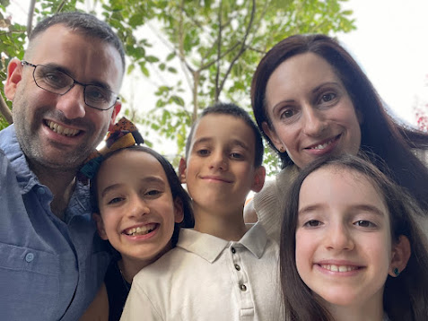  
  <figcaption>משפחת ליברמן, תמונת מצב 2025</figcaption>  
</figure>

הילדים בני 8,8 ו11, כל אחד מתעסק בתחביבים שהיו לו אז. הפיטים עולים לכיתה ד ואילו עלמה שרלוט עולה לחטיבה(!). השבוע האחרון של הטיול הזה, מוקדש לחגיגות בת המצווה של עלמה שרלוט שלי! 

<figure class="centered-img">  
  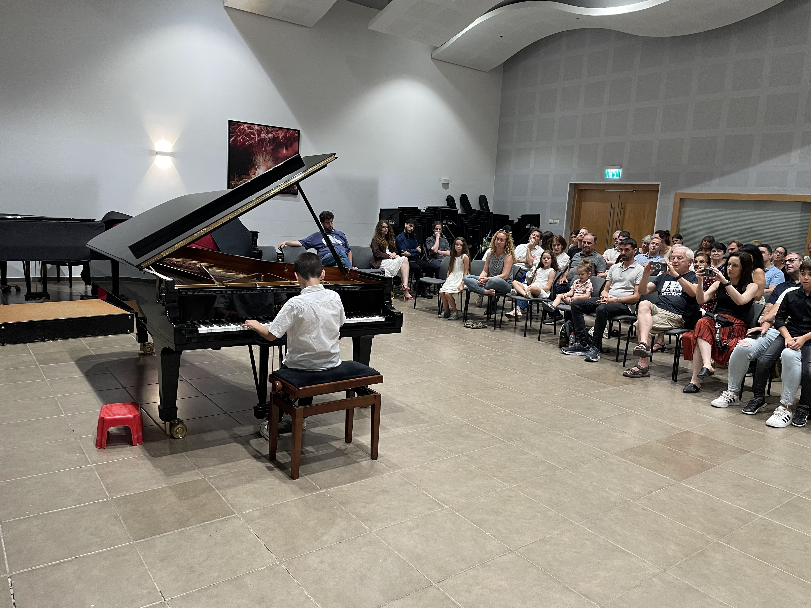  
  <figcaption>פיט האמיתי - קונצרט בקונס׳</figcaption>  
</figure>

<figure class="centered-img">  
  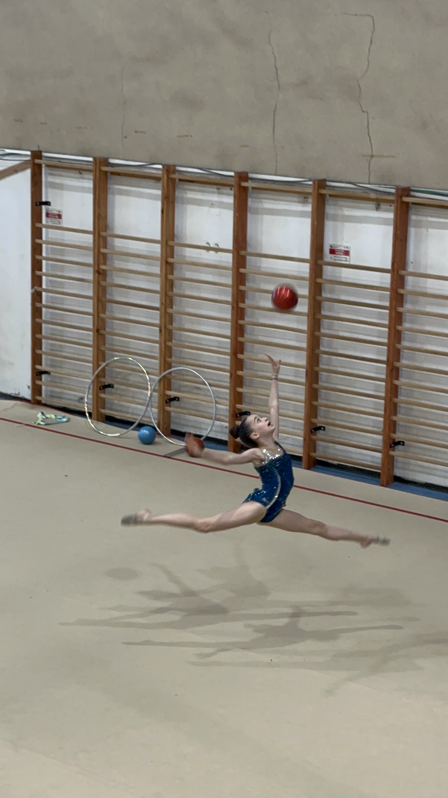  
  <figcaption>עלמה שרלוט בפעולה</figcaption>  
</figure>

<figure class="centered-img">  
  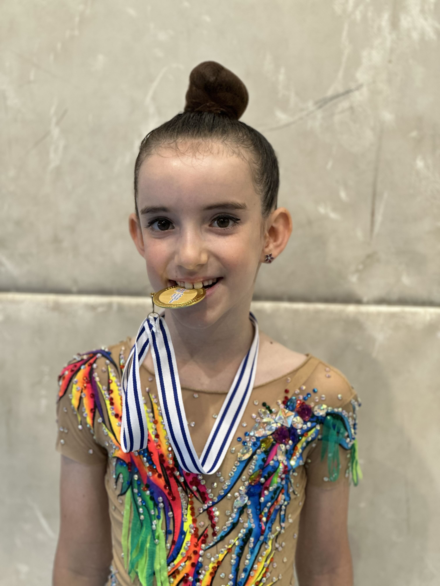  
  <figcaption>אלכס על הפודיום</figcaption>  
</figure>

<figure class="centered-img">  
  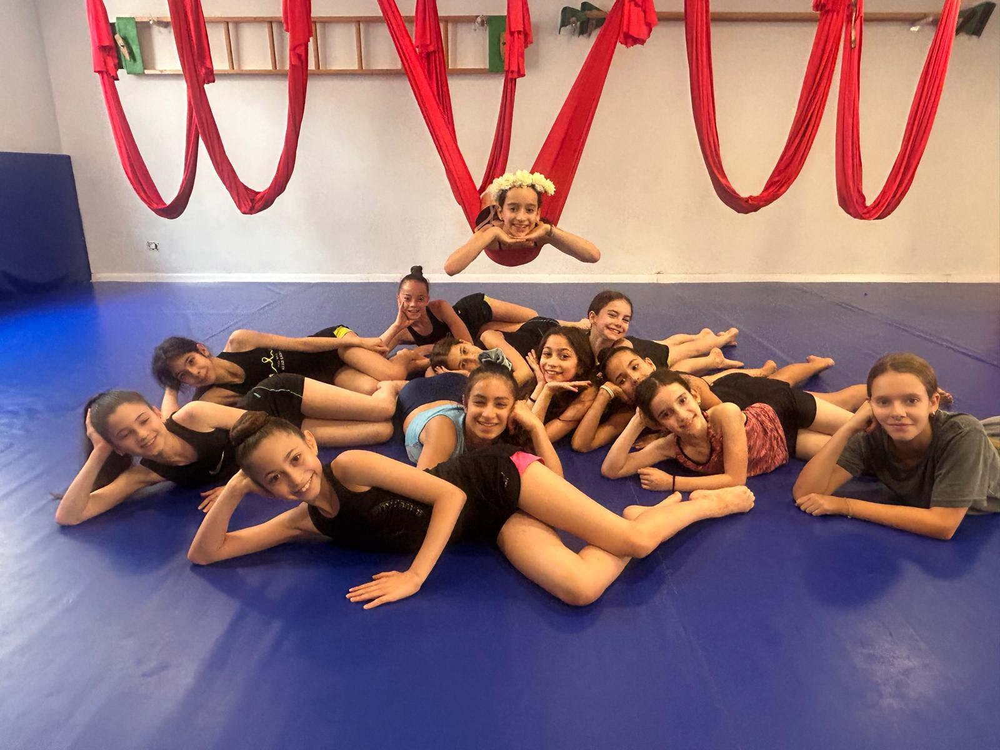  
  <figcaption>עלמה שרלוט - (עוד חלק מ)חגיגות בת-המצווה</figcaption>  
</figure>

## הטיול

בשלושת השבועות הראשונים של הטיול נחרוש בקראוון את פארקי הטבע של מערב קנדה. נתחיל את הטיול בקלגרי, ונגיע עד ונקובר איילנד. בשבוע האחרון נעבור לבגדים קצרים ונחליף תקליט לפארקי השעשועים של קליפורניה.

מאז המתקפה על איראן שקרתה בחודש האחרון, כבר פחדנו שכל הטיול הזה לא יצא לפועל, אבל המזל שיחק לנו וממש לפני כמה שעות השלמנו את המסע המפרך לקנדה! 

<figure class="centered-img">  
  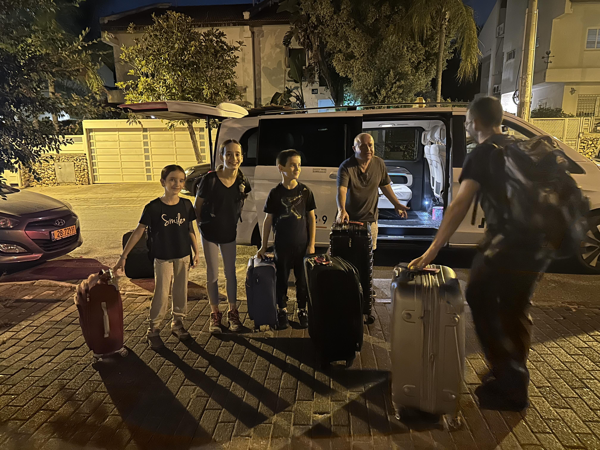  
  <figcaption>יוצאים למסע</figcaption>  
</figure>

<figure class="centered-img">  
  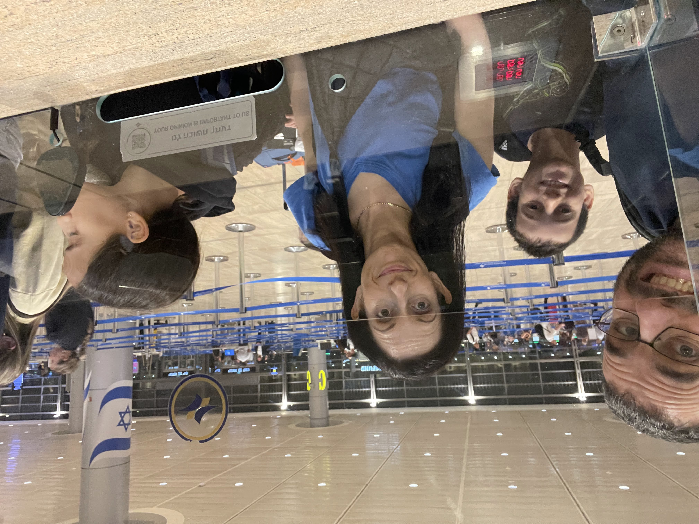  
  <figcaption>בורחים כל עוד אפשר!</figcaption>  
</figure>

<figure class="centered-img">  
  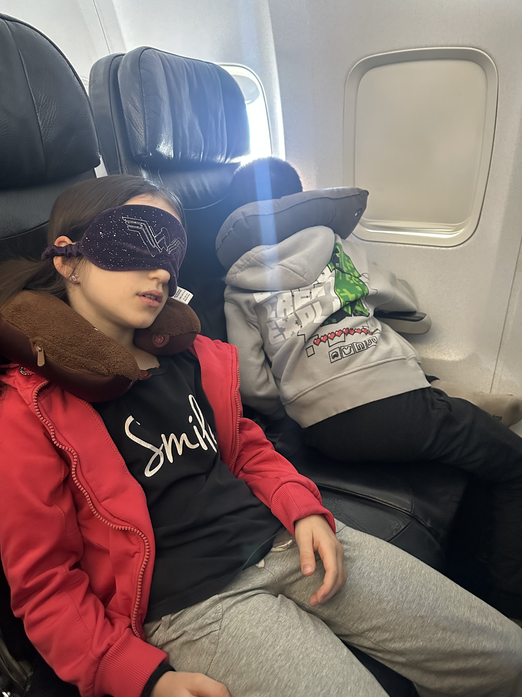  
  <figcaption>זה באמת קורה, אנחנו באויר</figcaption>  
</figure>

את המסע המפרך התחלנו בטיסה של 15 שעות ללוס אנג׳לס. אחרי הטיסה הקשה בה ״חזרנו בזמן״ וראינו בפעם השניה את הזריחה של אותו היום, אכלנו ארוחה מהסוג שקשה לסווג אותה כארוחת בוקר/צהריים/ערב, אבל קל לסווג אותה כ״ג׳אנק אמריקאי״. משם המשכנו בטיסה קצרה לקלגרי - נקודת המוצא שלנו להרפתקה בקנדה

<figure class="centered-img">  
  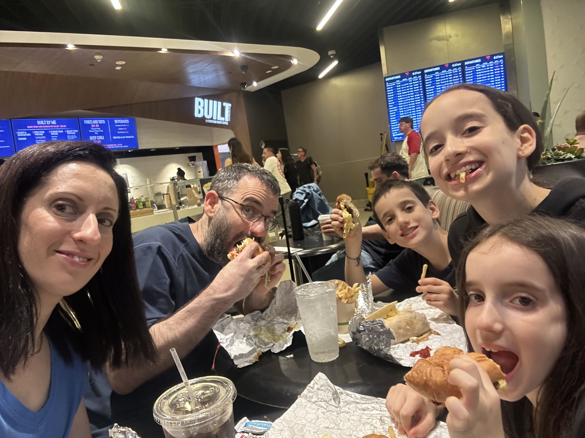  
  <figcaption>ארוחת ג׳אנק באמריקה</figcaption>  
</figure>

<figure class="centered-img">  
  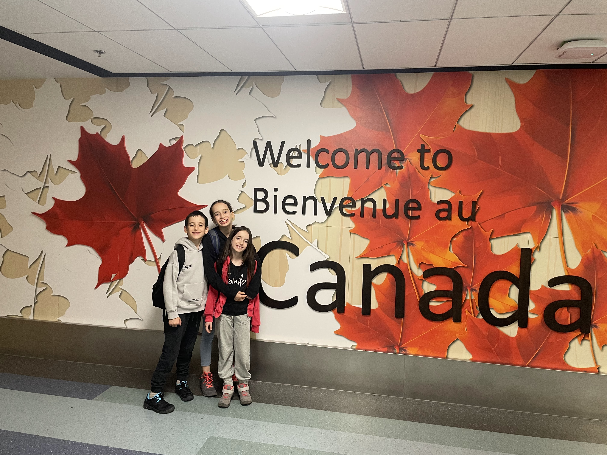  
  <figcaption>מגיעים לקנדה!</figcaption>  
</figure>

בזמן כתיבת שורות אלה, אני יושב כרגע בלובי של המלון בקלגרי. השעה 5 בבוקר והשעון הביולוגי שלי החליט שהגיע הזמן לקום ולכתוב פוסט פתיחה חגיגי למסע שלנו לקנדה 2025. אז... ברוכים הבאים, מוזמנים להצטרף להרפתקה!

היום ניסע לאסוף את הקראוון וניסע ליעד הראשון שלנו (הפארק הלאומי אגמי ווטרטון)

<figure class="centered-img">  
  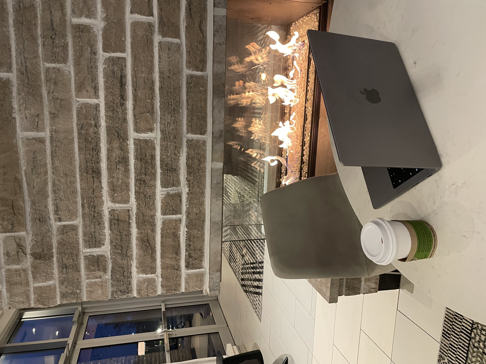  
  <figcaption>בוקר טוב קנדה, יוצאים לדרך</figcaption>  
</figure>
