לאחר המסע הארוך,  התמקמנו במלון בקלגרי והתרסקנו לשנת לילה אמיתית ממנה היה קשה להתעורר. הילדים ניצלו כל רגע מארוחת הבוקר האמריקאית הדוחה הראשונה והאחרונה להרבה זמן ועזבנו מוקדם כדי לאסוף את הקראוון.

<figure class="centered-img">  
  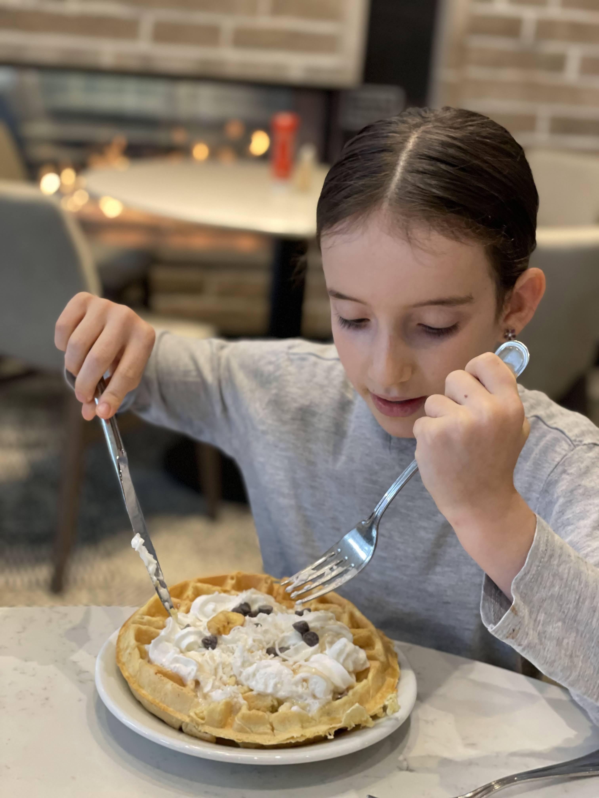  
  <figcaption>אלכס נהנית מכל רגע</figcaption>  
</figure>

ההתרגשות של הילדים מהקראוון היתה גדולה. הם זוכרים מאד לטובה  מארה״ב לפני 3. הקראוון יהיה הבית שלנו לשלושת השבועות הקרובים. משם המשכנו לוולמארט - עוד מקום שהילדים זוכרים מהטיול הקודם בתור הרפתקה כיפית עם חטיפים בגדלים לא הגיוניים. מכיוון שבאלברטה אסור לרכוש אלכוהול בסופרים, עברנו גם ב ״ליקר סטור״ והתחלנו באיבזור ״מרתף היינות הנייד״ שלנו. הנמלה כמו נמלה, באה עם רשימת קניות מוכנה עוד מהארץ וסרקה את המסדרונות בשיטתיות נמלית, בעוד אני והילדים הלכנו לכל עבר בעקבות החושים שלנו כמו בלונפארק ענקי ועשינו משימות נקודתיות של מציאת חוסרים. כל ילד קיבל אישור לקנות חטיף (מותר שיהיה עד פי שניים גדול יותר מהראש שלו, ויצאנו לדרך!

<figure class="centered-img">  
  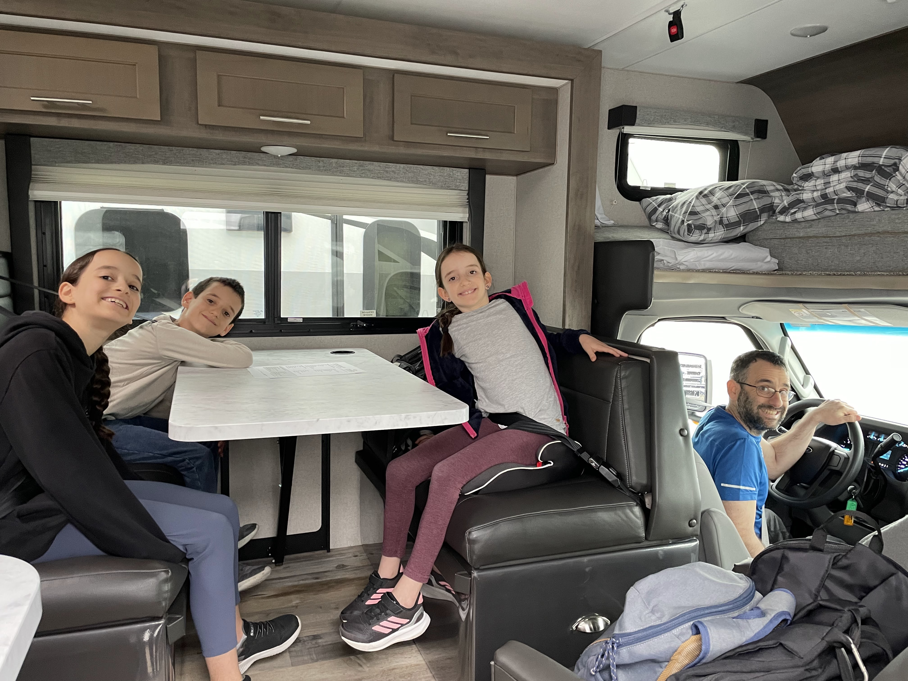  
  <figcaption>איסוף הקראוון</figcaption>  
</figure>

<figure class="centered-img">  
  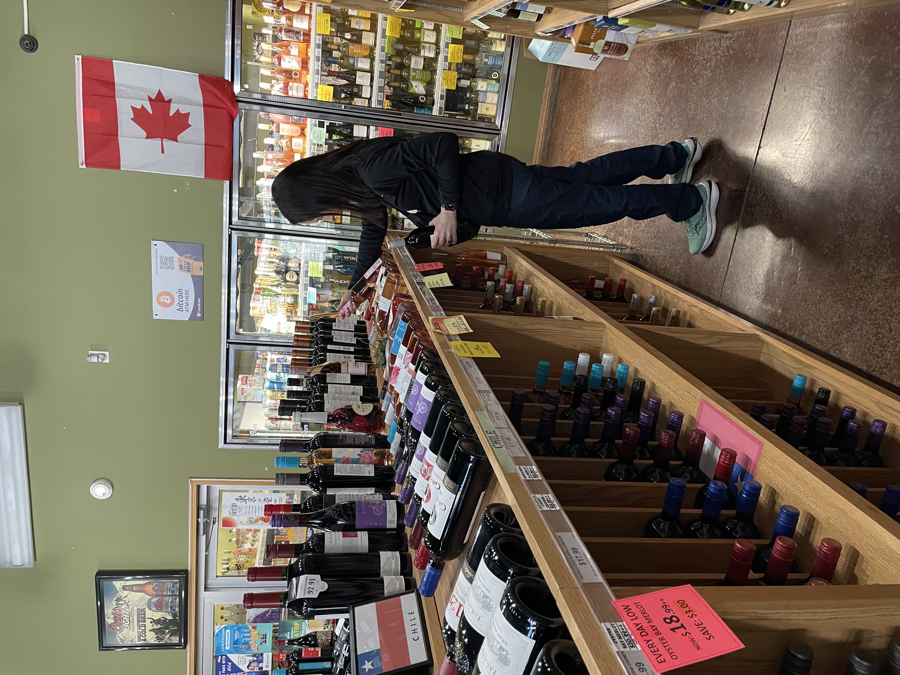  
  <figcaption>הנמלה ״מתארגנת״</figcaption>  
</figure>

<figure class="centered-img">  
  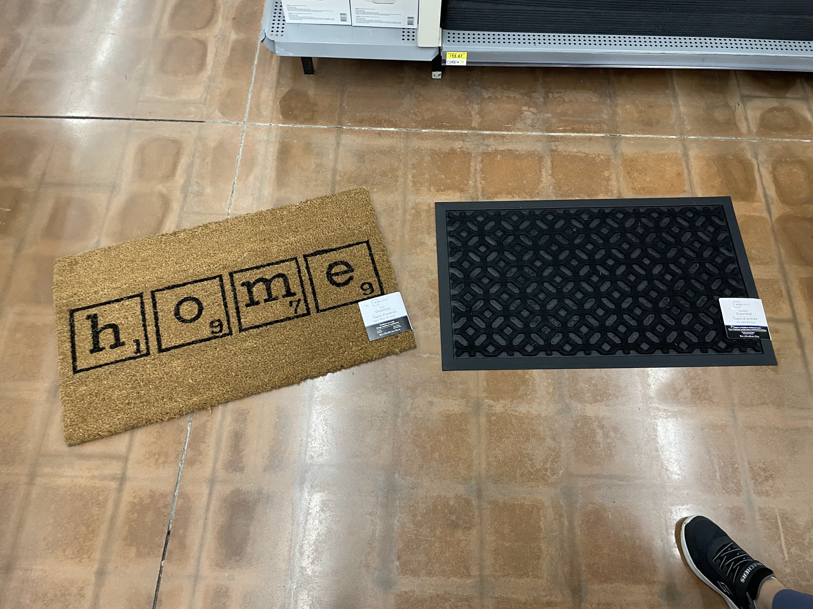  
  <figcaption>איך תראה הכניסה לבית? קניות בוולמארט</figcaption>  
</figure>

<figure class="centered-img">  
  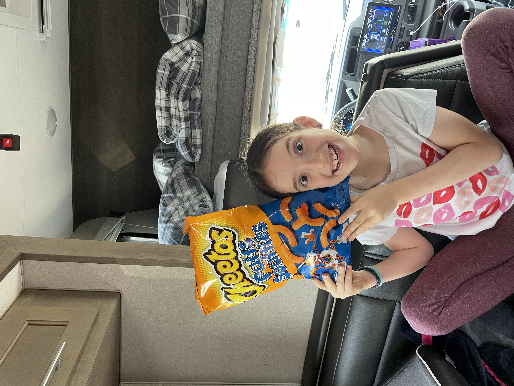  
  <figcaption>אלכס עם הקניה שלה - עומדת ב״תקן״</figcaption>  
</figure>

<figure class="centered-img">  
  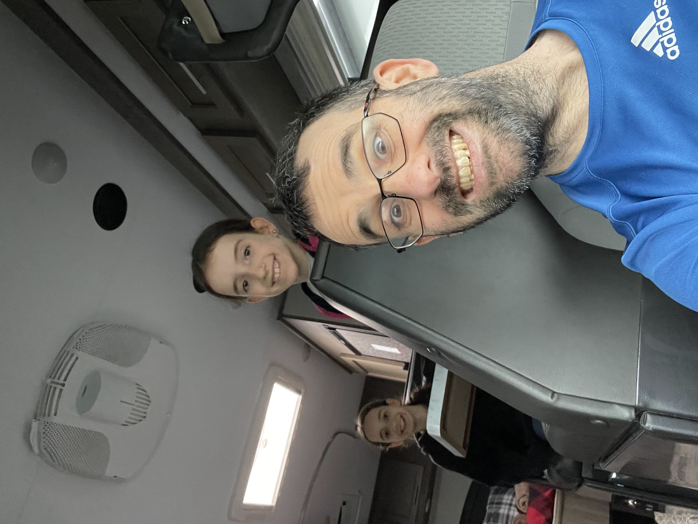  
  <figcaption>יוצאים לדרך!</figcaption>  
</figure>

אין כמו נסיעה של 3 שעות כדי להתחיל ״קורס נהיגה במשאית מזורז״. בהתחלה זה קצת מלחיץ וצריכים להתרגל לרעשים שכל החפצים המיטלטלים עושים כשהדרך לא מספיק טובה, אבל בכבישים מהירים זה ממש בסדר. במהירויות נמוכות הקראוון שקיבלנו עושה רעש מאד ספציפי שזכה לכינוי ״האיש השורק״ בפי הילדים. עם הזמן ״האיש השורק״ קיבל עוד כינויים וסיפורי רקע שונים ומשונים, אבל... הוא לגמרי חלק מהמשפחה בטיול

הCampground הראשון שלנו  [Townsite Campground]([Townsite Campground - Waterton Lakes National Park](https://parks.canada.ca/pn-np/ab/waterton/activ/camping/townsite-camping)) ממוקם בתוך שמורת הפארק הלאומי Waterton יושב בתוך השמורה על שפת אחד מהאגמים הרבים שבה. כשהגענו התחלקנו לצוותים - בעוד הילדים שיחקו על שפת האגם, הנמלה ״עשתה נמלה״ לקראוון והפכה אותו ממשאית לבית, פרקנו את המזוודות ומצאנו מקום לכל החפצים האישיים והמשותפים של כולם.

<figure class="centered-img">  
  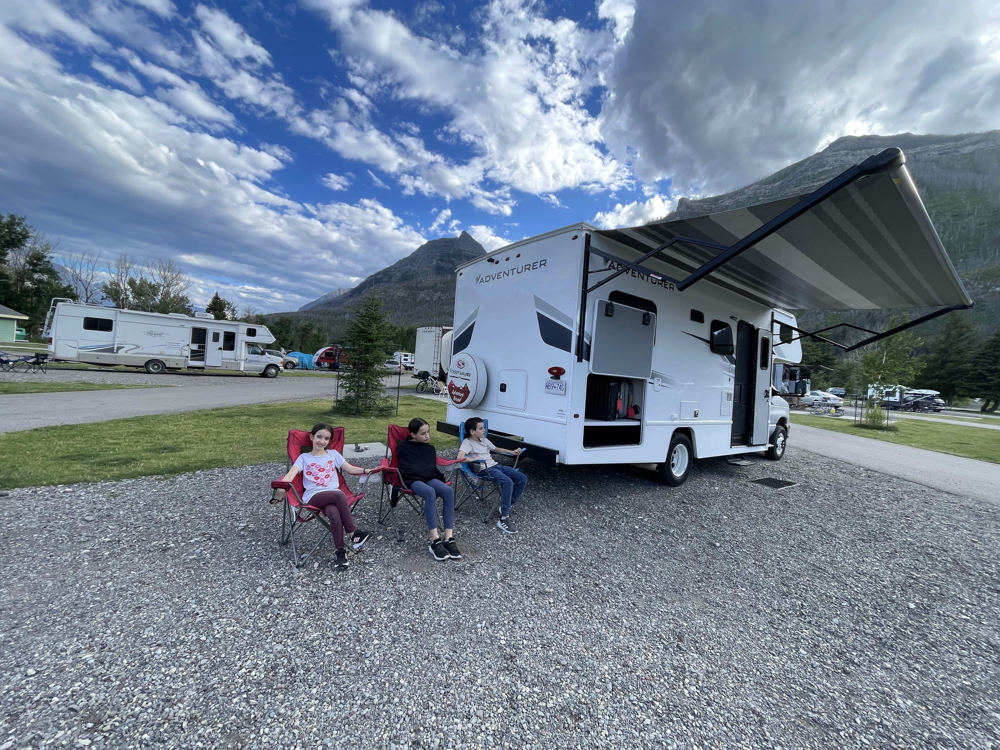  
  <figcaption>החניון הראשון שלנו בטיול</figcaption>  
</figure>

<figure class="centered-img">  
  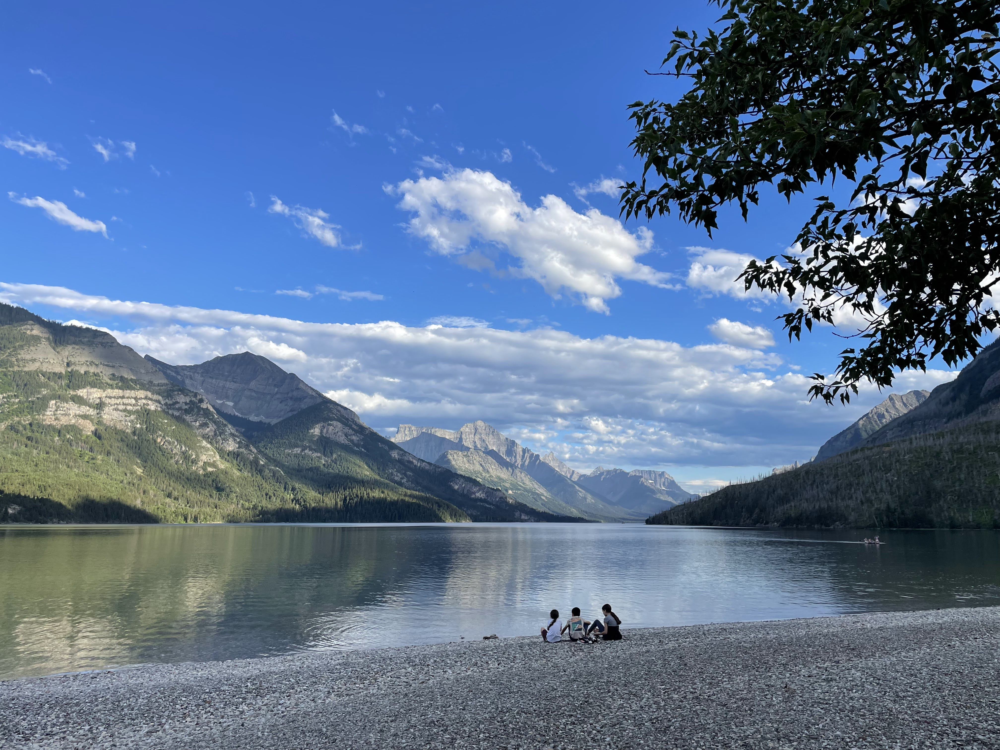  
  <figcaption>משחקים ליד האגם</figcaption>  
</figure>

<figure class="centered-img">  
  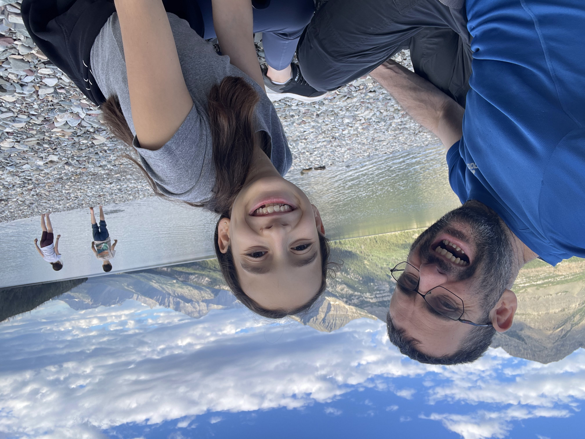  
  <figcaption>שיחת שובבים על המים</figcaption>  
</figure>

בזמן שישבתי עם עלמה שרלוט על שפת האגם וחשבתי מה להכין לארוחת הערב הראשונה - הבעיה ״פתרה את עצמה״. חברי כת כלשהי (אולי אמיש, אולי אחרת) פנו אלינו וסיפרו שהם הכינו יותר מידי אוכל וחבל להם לזרוק אותו. הם לא ידעו מה זה ישראל או איפה זה - חשבו שהגענו משם בנסיעה או שחיה, אבל היו מאד נחמדים והקלו עלינו את הערב הראשון. נחמד שהילדים כבר יודעים קצת אנגלית. טיול כזה מאפשר להם לשמוע המון אנגלית ואפילו לתרגל כשזרים פונים אליהם בכל מיני סיטואציות. דווקא האנגלית ה״יום יומית״ מאפשרת להם להבין טוב יותר משפטים ומקדמת אותם מאד. פיט סיפר לי שכילד זר פנה אליו בשאלות עבר לו בראש: ״לרוץ ולברוח״, ״לעשות כאילו הוא מפגר״, והוא בחר יפה בלהסביר שהוא ״לא מדבר אנגלית״. עד סוף הטיול, מקווה שלפחות שתי האופציות הראשונות לא תהיינה יותר על הפרק 😅

החניון היה נחמד והיו בו הרבה סנאים שקפצו כל הזמן מתוך מחילות תת קרקעיות והפתיעו אנשים שהולכים. האיזור כולו הוא ממלכת הדובים, אז כמובן שאסור להשאיר אוכל בחוץ בלילה ולהיות ערניים במיוחד כשמסתובבים לבד. בזמן ארוחת הערב, הפתיע אותנו סוג של אייל שחלף על פנינו והמשיך בענייניו. אפילו לא ממש התחלנו את הטיול וכבר ראינו לא מעט טבע וחיות!

<figure class="centered-img">  
  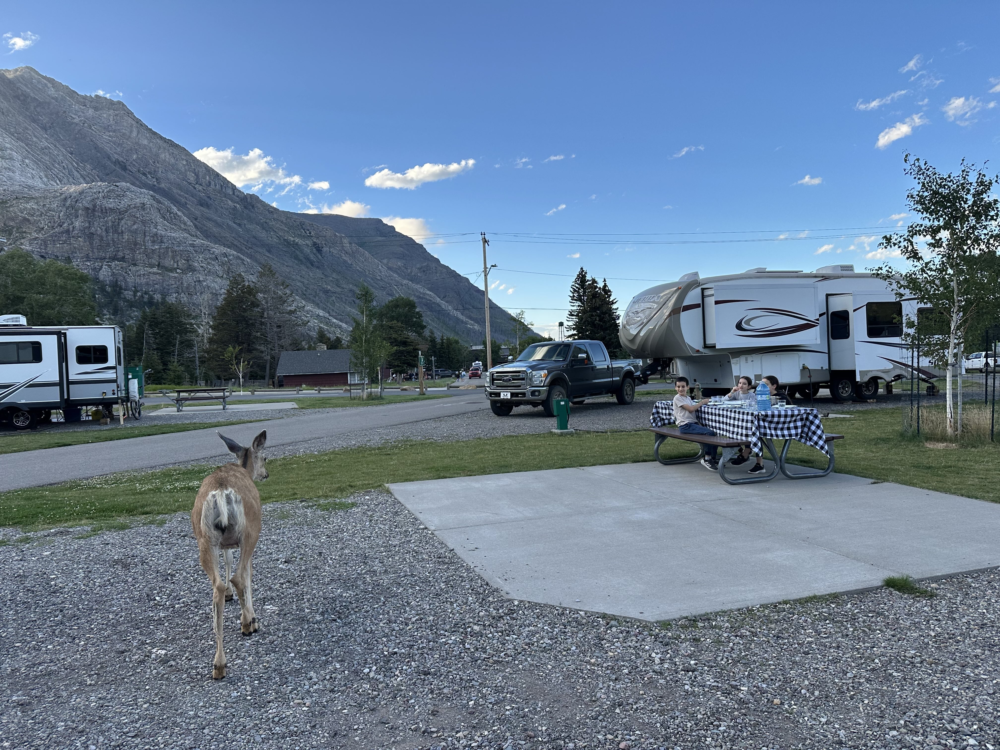  
  <figcaption>אייל בארוחת הערב</figcaption>  
</figure>

בזמן שהנמלה התרחצה אני והילדים רקמנו את המזימה! בעוד בטיול הקודם הפיטים היו עדיין קטנים ולא רצינו שישנו במיטות העליונות של הקראוון ויצנחו בלילה אל מותם בטרם עת, המצב השתנה. פרט לכך שהם גדלו ב3 שנים, בקראוון הנוכחי יש רשת ביטחון שבהחלט יכולה לעזור. הנמלה לא השתכנעה ורצתה שההורים ישנו בכוך הקטן הזה, אבל בשיתוף פעולה של הילדים כשהנמלה חזרה מהמקלחת הצגנו לה סדרה של תרחישי לילה מומחזים הכוללים - התגלגלות תוך כדי סיוט אל תוך הרשת, הליכה לשרותים מתוך שינה ובעיקר הרבה צחוק של ילדים ממחיזים. התחלנו בפיילוט שינה שלימים יהפוך להיות סידור השינה הקבוע. המבוגרים נהנים ממיטה נורמאלית ונוחה, והילדים מקבלים את החוויה של לישון במקום מיוחד. כולם מרוויחים!

<figure class="centered-img">  
  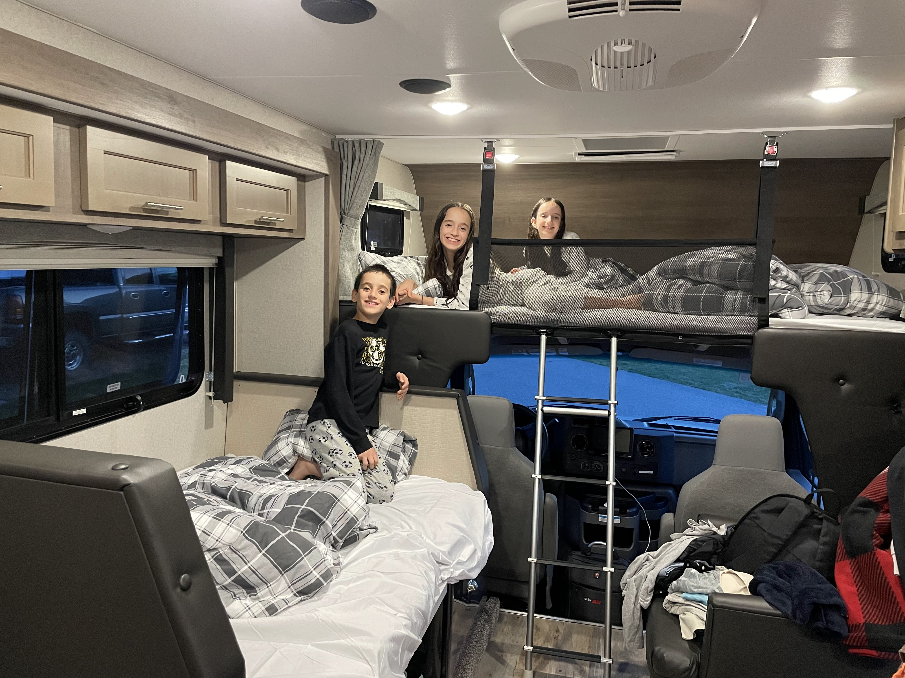  
  <figcaption>מקרים ותגובות - ״המחזה״</figcaption>  
</figure>

<figure class="centered-img">  
  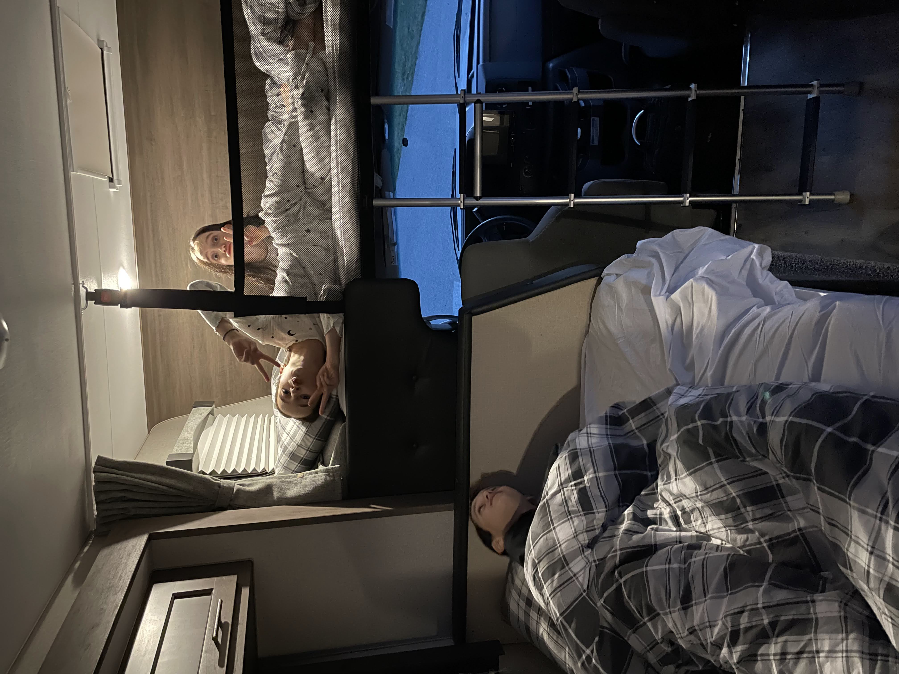  
  <figcaption>הולכים לישון פעם ראשונה בקראוון!</figcaption>  
</figure>

הלילה הראשון עבר בשלום! אלכס לא צנחה אל מותה, ופיט לא הלך מתוך שינה והצטרף למשפחת דובים! היום נעשה את המסלול הראשון שלנו בטיול. בחרנו במסלול Bear's Hump הקליל שהתחיל קרוב מאד לחניון הלילה שלנו בתוך השמורה. המסלול

<figure class="centered-img">  
  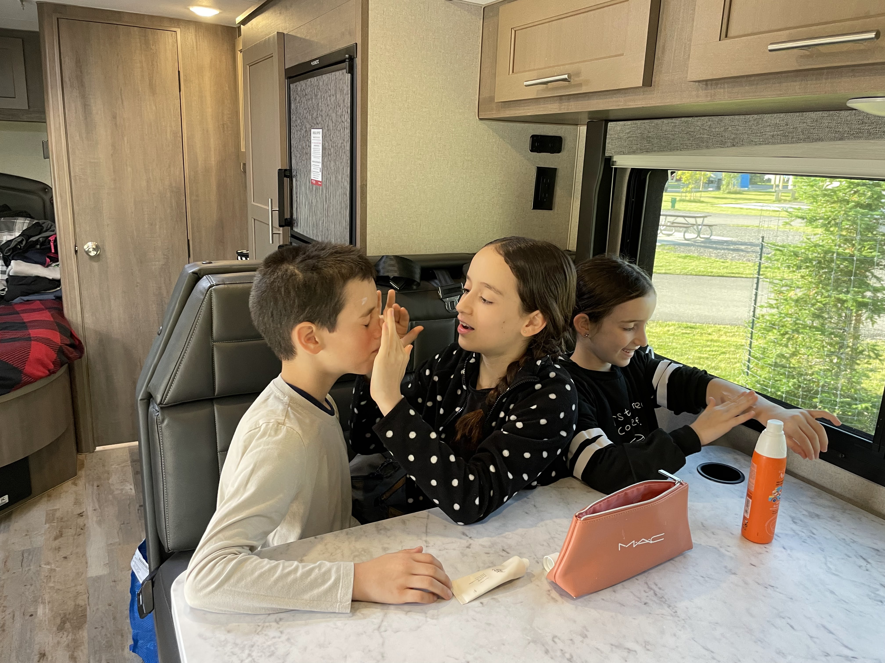  
  <figcaption>טקס מריחת קרם הגנה - ויוצאים לדרך!</figcaption>  
</figure>

<figure class="centered-img">  
  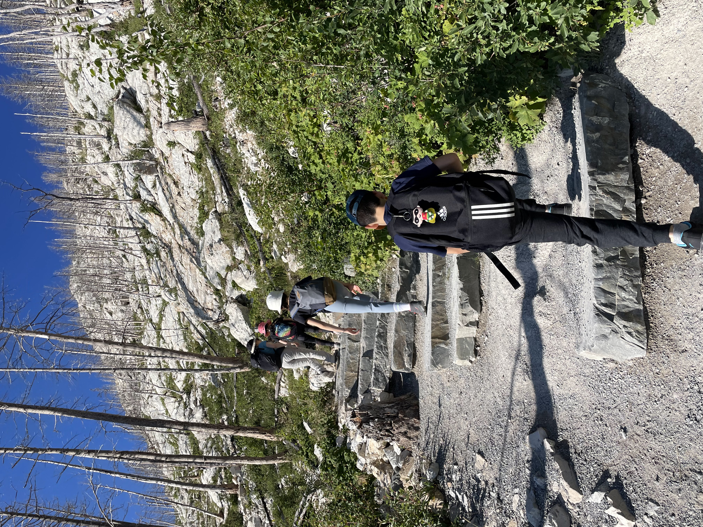  
  <figcaption>מתחילים בטיפוס</figcaption>  
</figure>

<figure class="centered-img">  
  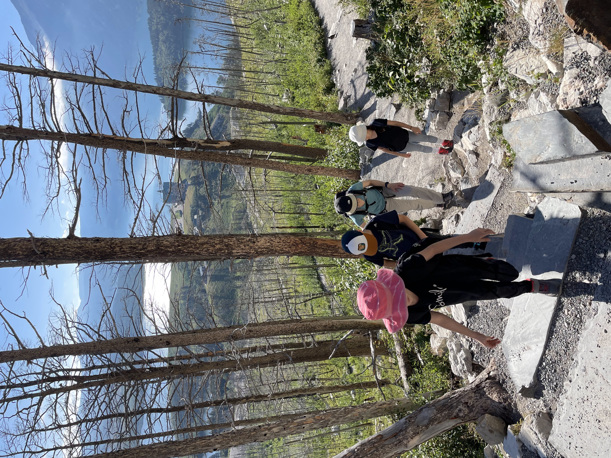  
</figure>

<figure class="centered-img">  
  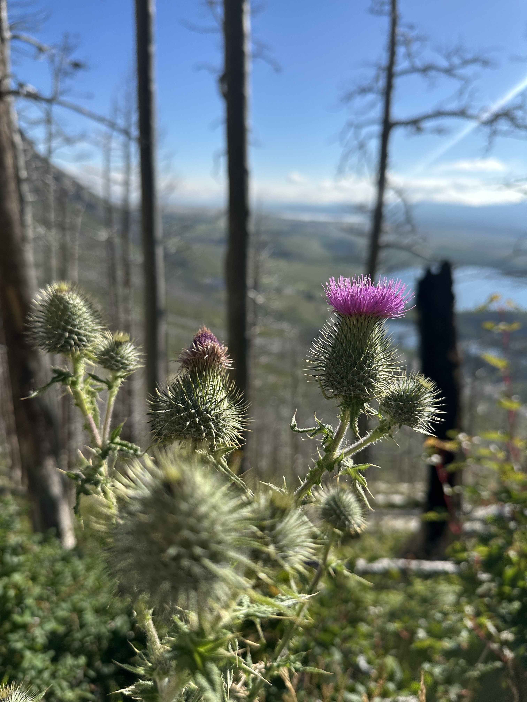  
</figure>

המסלול היה מושלם בתור ״מסלול כניסה לכושר״ קליל (פחות משעתיים כולל הפסקת ארוכה בפסגה - טיפוס של כ200 מטר). הנופים מהפסגה היו ״מטורפים״. אגם קסום, הרים גבוהים, ואפילו ״טירה״ עתיקה כחלק מהנוף (מלון ״הנסיך של ווילס״ נפתח ב1927). בפסגה ביקרו אותנו סנאים שמנמנים שרצו לחלוק איתנו את הכריכים.

<figure class="centered-img">  
  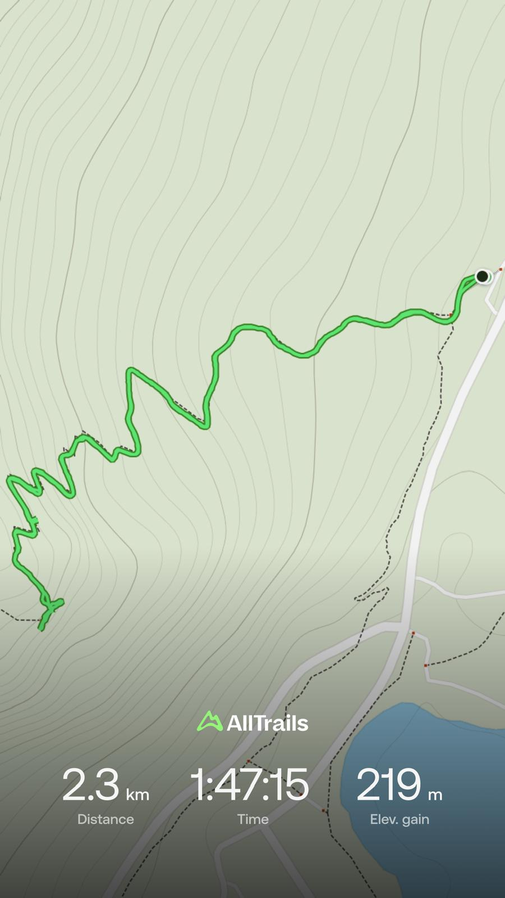  
  <figcaption>פרטי המסלול</figcaption>  
</figure>

<figure class="centered-img">  
  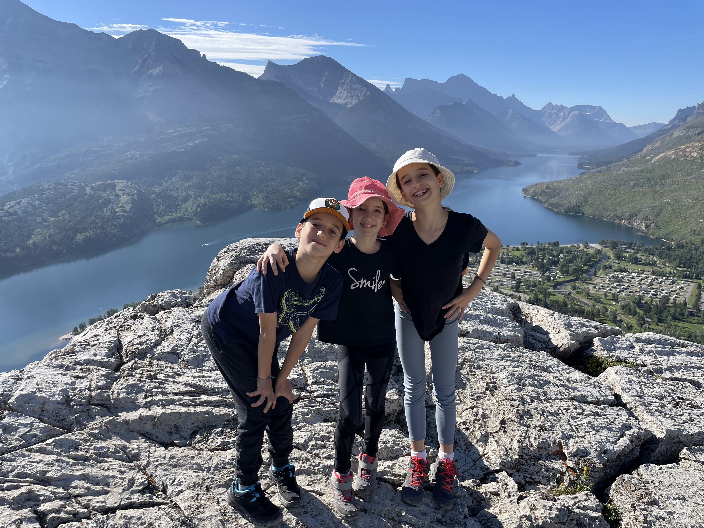  
  <figcaption>הילדים כובשים את גיבנת הדב</figcaption>  
</figure>

<figure class="centered-img">  
    
  <figcaption>פנורמה מהפסגה</figcaption>  
</figure>

<figure class="centered-img">  
  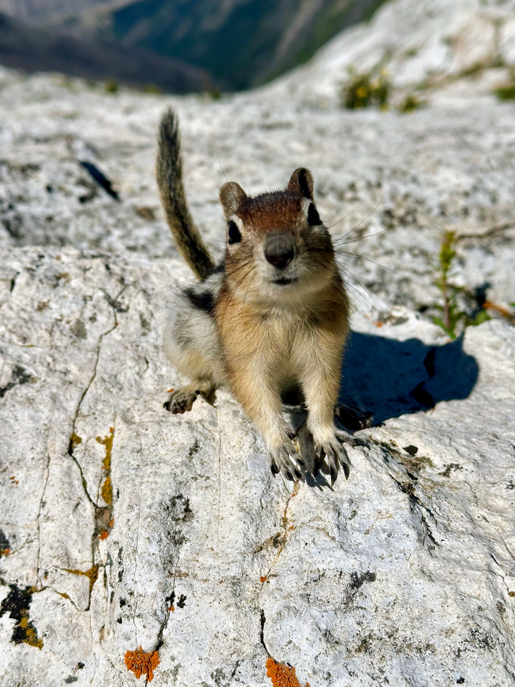  
  <figcaption>שותף לכל ארוחה</figcaption>  
</figure>

<figure class="centered-img">  
  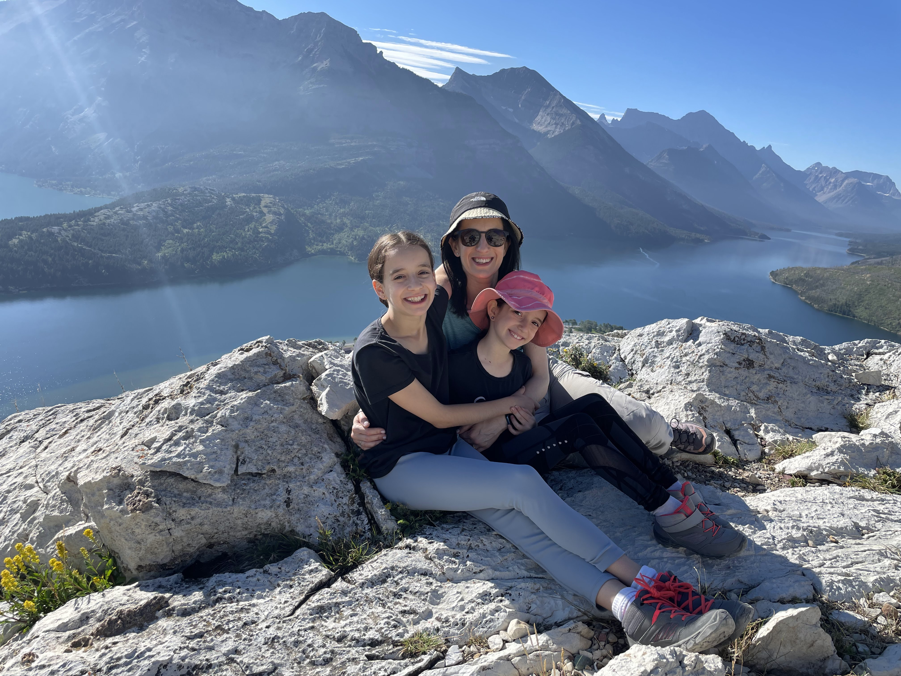  
  <figcaption>הבנות</figcaption>  
</figure>

<figure class="centered-img">  
  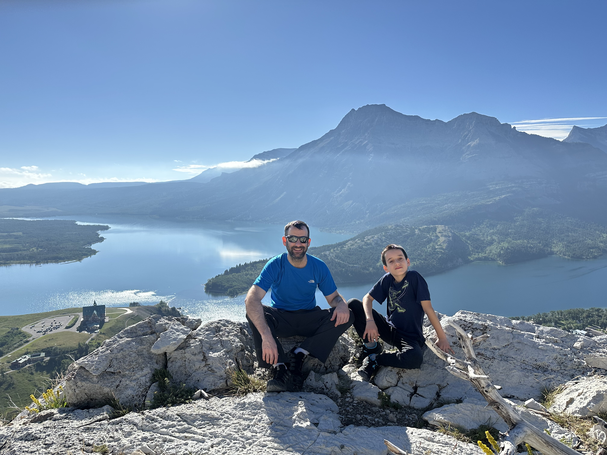  
  <figcaption>הבנים</figcaption>  
</figure>

<figure class="centered-img">  
  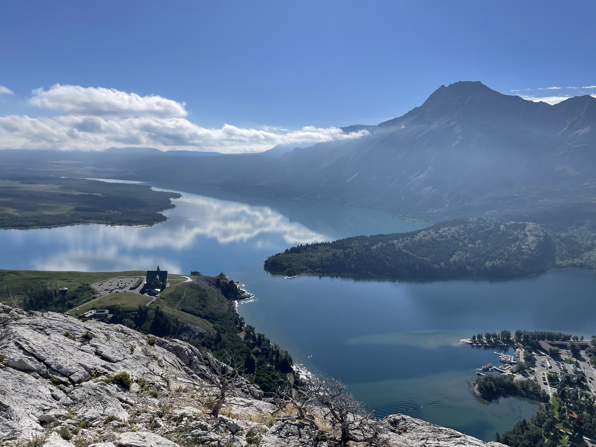  
  <figcaption>נוף קסום מהפסגה, אי אפשר להפסיק לצלם</figcaption>  
</figure>

כבר כשהתחלנו לטפס, הבחנו שמנו לב שמשהו "לא בסדר״ ביער. מרבית העצים ״עירומים״ מעלים והירוק היחיד שנראה היה צמחיה נמוכה. הסקנו שכנראה היתה כאן שריפה, ואכן, בירור קצר העלה שאכן היה בפארק ארוע שריפה משמעותי. ב2017 שריפה שקיבלה את השם Kenow השמידה כ40% משטח הפארק(!) השריפה, שהתלקחה בעקבות מכת ברק, שינתה מאד את אופיו של הפארק. אמנם אנחנו, בני האדם, נוטים לראות בארועים כאלו דבר שלילי, לטבע אין העדפות - הוא תמיד נמצא בהתחדשות והתאמה למציאות החדשה. 

מעניין לראות (וגם לקרוא בדיעבד) על השינויים שעברה הצמחיה והשינוי בהרגלים של החיות ביער. מה ש״לא עבד״, הפסיק להתקיים במחזור הזה והתחלף, ומה שהתאים את עצמו - שרד.  סוגים מסויימים של עצי אשוח תלויים בשריפות - האצטרובלים שלהם ״משחררים״ את הזרעים רק בטמפרטורות גבוהות, בעוד עצי צפצפה ״יודעים״ להצמיח עצים חדשים מתוך השורשים ששרדו. דילול הצמחיה הגבוהה מאפשר התפתחות של שיחים נמוכים ו״פותח את התחרות״ למינים שונים של צמחיה להתפתח. גם לשרידים של העצים השרופים יש תרומה - ההתפוררות האיטית שלהם מספקת מזון לקרקע, וגם השלדים שלהם משמשים לקינון של מינים מסויימים. מרבית החיות הגדולות בפארק שרדו והתאימו את עצמן. [סרטון]([One year after the Kenow Wildfire - YouTube](https://www.youtube.com/watch?v=lUtq9WHAWKI)) שמתאר את השיקום אחרי שנה. מעניין לעקוב שוב אחרי הפארק וללמוד מה השתנה פה בחלוף השנים. גם בני האדם לומדים להתמודד עם השינויים בטבע, לפעמים הדבר הנכון הוא להתנגד לאינסטינקט שלנו לנסות לתקן ופשוט - לתת לטבע לעשות את שלו.

<figure class="centered-img">  
    
  <figcaption>הדרך למטה בתוך היער ה״עירום״</figcaption>  
</figure>

<figure class="centered-img">  
  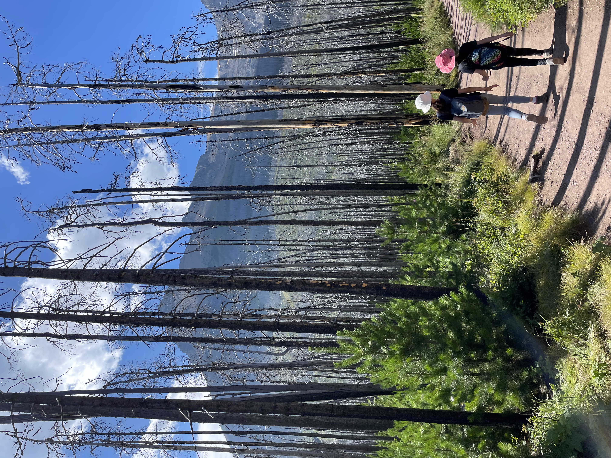  
  <figcaption>צמחיה חדשה מחליפה את השרופה</figcaption>  
</figure>

<figure class="centered-img">  
  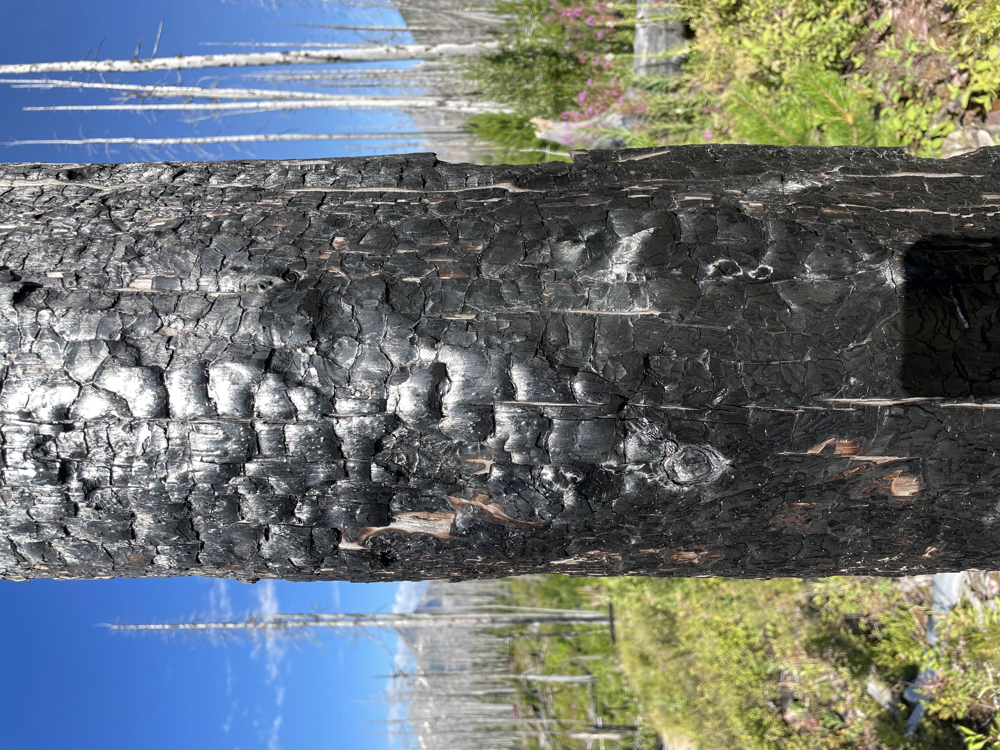  
  <figcaption>טבע בהתחדשות</figcaption>  
</figure>

כשהגענו בחזרה לחניון כבר לא היתה אפילו חניה אחת פנויה, ״עשינו את היום״ למטיילים כשהזזנו את הקראוון שלנו משם. משם היינו צריכים להחליט על הפעילות הבאה. הוחלט פה אחד (הפה שלא הנמלה), שבמקום להמשיך לשייט רגוע באגם בקאנו נבקר ב[Blakiston falls](https://www.alltrails.com/trail/canada/alberta/blakiston-falls-trail). המסלול נחמד, מוביל לתצפית על מפל בקונסטרוקציות גשרים ומסיים ערוץ נחל שצבע קירותיו אדמדמים. חשוב לציין כאן בשורות אלו, שאמא נמלה ״חייבת לנו סירה״!

<figure class="centered-img">  
    
  <figcaption>מפלי Blakinston</figcaption>  
</figure>

<figure class="centered-img">  
  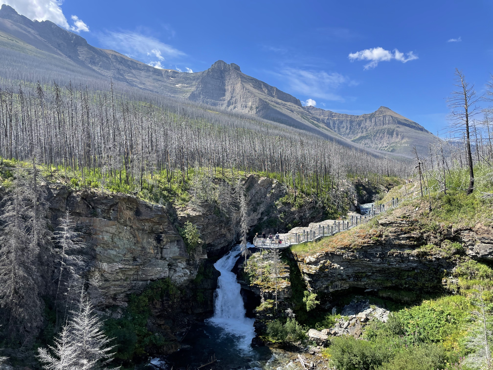  
  <figcaption>גשרי הליכה לתצפית</figcaption>  
</figure>

מכאן ניסע לכיוון גבול ארה״ב ונצא לגיחה לפארק הלאומי Glacier ממדינת מונטנה בארצות הברית של אמריקה, לפני שנחזור צפונה להמשך המסלול בקנדה

המשך יבוא...
