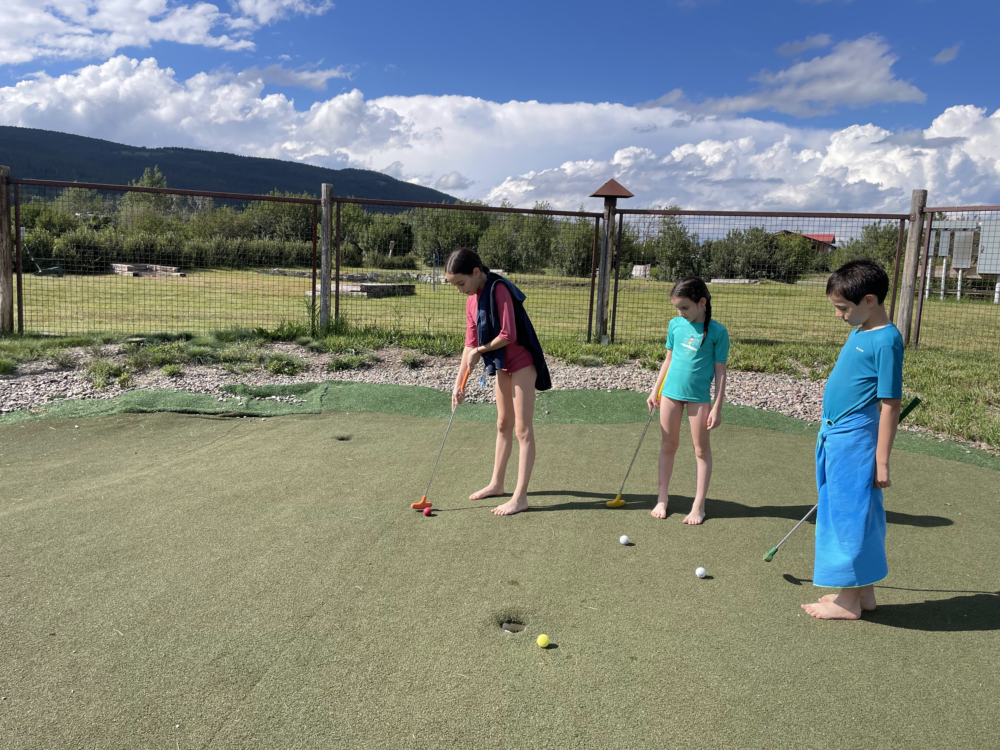
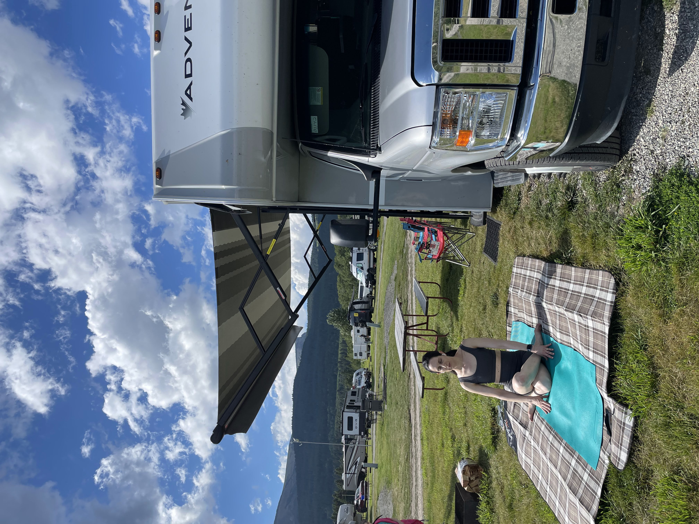
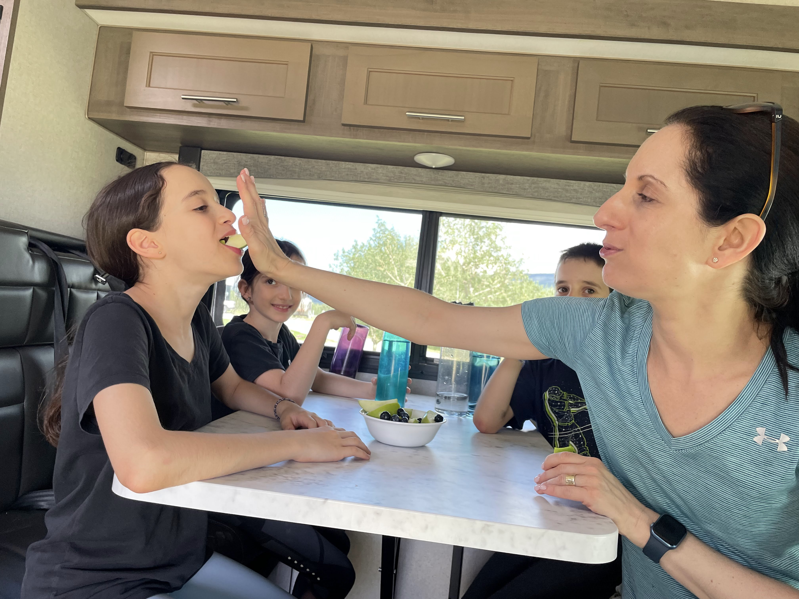
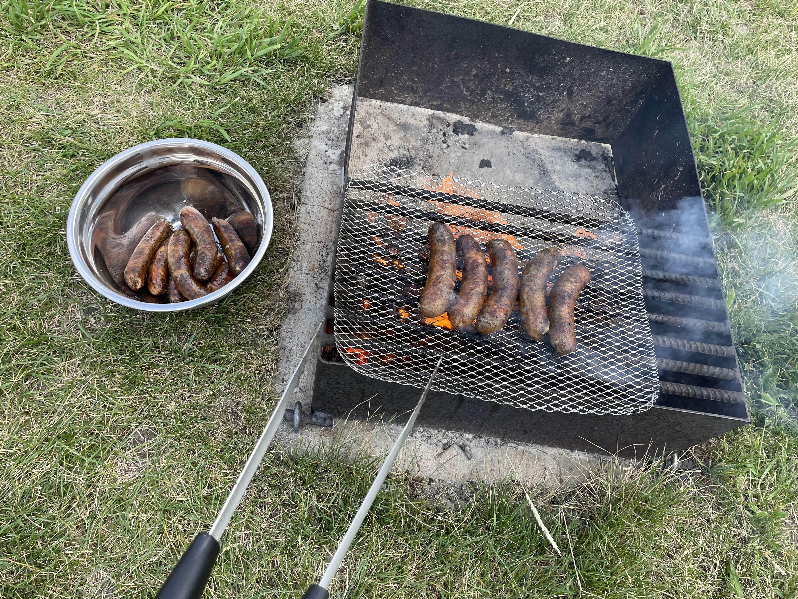
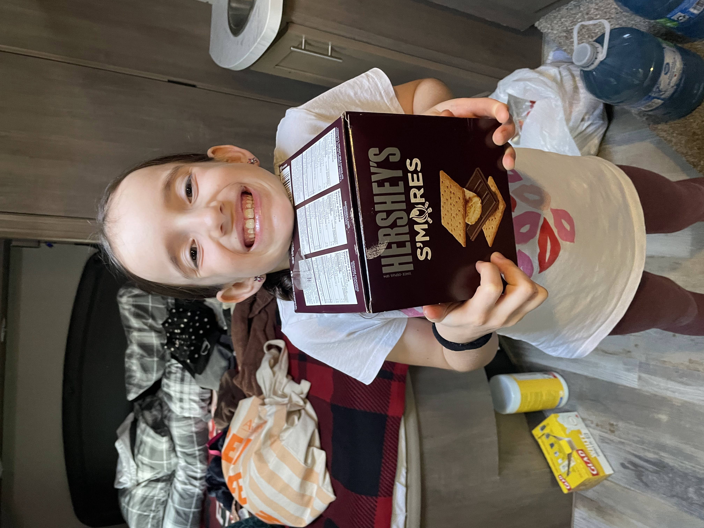
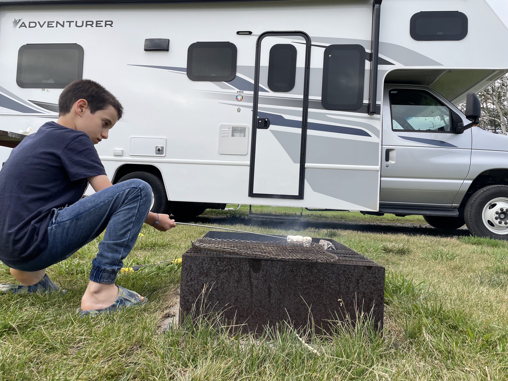
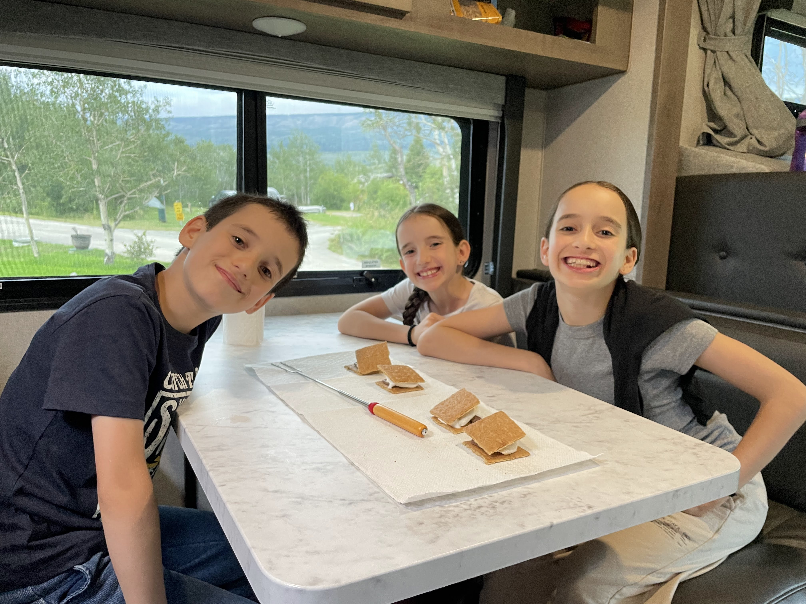
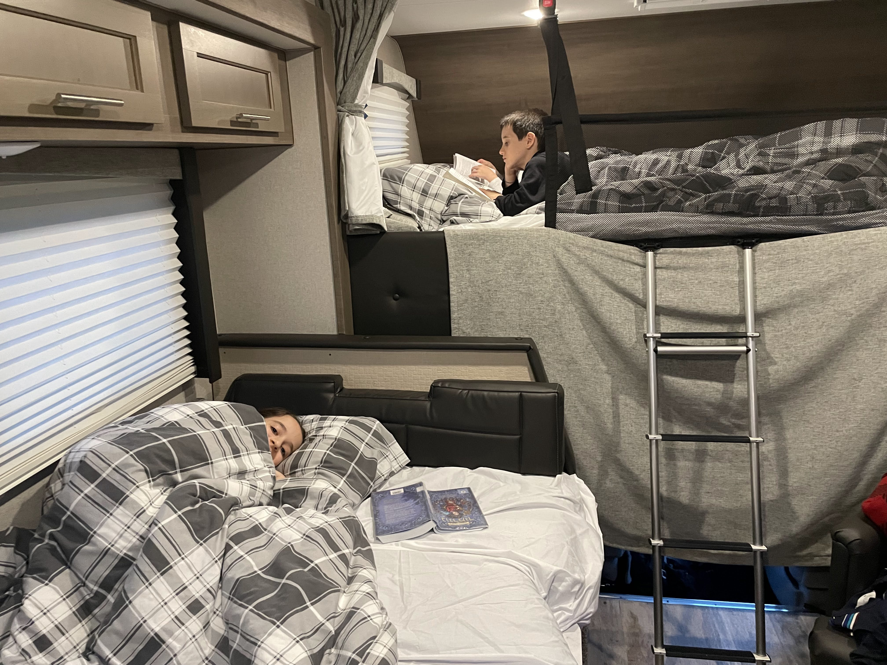

עזבנו את פארק ווטרטון הקנדי ו״קפצנו״ ל 4 ימים לפארק הלאומי גליישר בארה״ב. המעבר לארה״ב לא ממש הורגש: פקיד חמור סבר ביקש לראות את הדרכונים שלנו מבעד לחלון הקראוון, דרש שנסיר את משקפי השמש ושאל שאלות בקול חצי תקיף וחצי מנומנם. כל ארוע הכניסה לארהב לקח בדיוק 3 דק׳. היחיד שהתרגש ממעבר הגבול היה הטלפון - אשר בשניה שעברנו את הגבול הכריז בחגיגיות: ״Welcome to the united states of america״.

הפעם ישנו מחוץ לשמורה ב [KOA](https://koa.com/campgrounds/st-mary/) (רשת חניונים אמריקאית פרטית) מה שאומר שהיו בחניון יותר פעילויות נחמדות לילדים. 

<figure class="centered-img">  
    
  <figcaption>מיני זמן שקט להורים (וגולף)</figcaption>  
</figure>

<figure class="centered-img">  
    
  <figcaption>פיטים מצויים בסביבתם הטבעית</figcaption>  
</figure>

<figure class="centered-img">  
    
</figure>

<figure class="centered-img">  
    
  <figcaption>פנאי הורי</figcaption>  
</figure>

למרות מזג האוויר ההפכפך החלטתי לבחון את כישורי צליית המדורה שלי. בניגוד לטיול הקודם לארה״ב, הילדים גדלו, ועכשיו לא נשארות שאריות כל כך מארוחות הערב. הילדים טרפו - למרות שהנמלה חזרה להרגל המגונה שלה מהארץ ״לדחוף פרי״ לילדים לפני ארוחת הערב ולהוציא להם את התאבון. אי אפשר לנצח נקניקיות איכותיות על האש עם קצת פרי! קינחנו גם בקינוח קמפינג המסורתי והלכנו לישון מוקדם לקראת הטיול הראשון בפארק למחרת. מכיוון שהשקיעה כאן מאוחרת (אחרי 21:00), כשרוצים ללכת לישון מוקדם לקראת מסלול, במקום ״כיבוי אורות״, אנחנו מעבירים את הקראוון ל״מצב לילה״ ומחשיכים באמצעות וילונות

<figure class="centered-img">  
    
  <figcaption>הרגל נמלתי מגונה לסיכול רעב הילדים</figcaption>  
</figure>

<figure class="centered-img">  
    
  <figcaption>אוהבים נקניקיות?</figcaption>  
</figure>

<figure class="centered-img">  
    
  <figcaption>כן!!!</figcaption>  
</figure>

<figure class="centered-img">  
    
  <figcaption>אבל זה לעולם לא יפריע לאלכס לדרוש קינוח</figcaption>  
</figure>

<figure class="centered-img">  
    
</figure>

<figure class="centered-img">  
    
  <figcaption>Smores ראשון בטיול מבין רבים וטובים</figcaption>  
</figure>

<figure class="centered-img">  
    
  <figcaption>רגע לפני כיבוי אורות</figcaption>  
</figure>

למחרת התחלנו את הטיול הראשון בשמורה. התחלנו בטיול קצר יחסית למפלי St. Mary ו Virginia. הפארק כולו, במיוחד בשעות שיש פחות מטיילים שורץ דובים. בעונה הזאת הם אוכלים כמעט 24 שעות ביממה כדי לעלות במשקל לקראת שנת החורף. בניגוד לטיול בווטרטון, המסלול ברובו לא הושפע משריפה והיה צפוף בעצים וצמחיה. לפי הנחיות החיות הריינג׳ר היינו צריכים לעשתו הרבה רעש בהליכה כדי להמנע ממפגשי דובים, מה שהפך את הטיול לכיפי ומלא ״שירי דובים״ מאולתרים. ניסינו לדמיין את הדובים מסתתרים ביער העצום שלפנינו, ועלמה שרלוט, עם עולם האסוציאציות הספציפי שלה,  דמיינה איך ״מסרק דובים״ ענקי עובר ביער בין עצי האשוח וחושף עשרות דובים בכל סירוק

<figure class="centered-img">  
    
  <figcaption>נכנסים לארץ הדובים</figcaption>  
</figure>

<figure class="centered-img">  
    
  <figcaption>אל תוך היער שורץ הדובים</figcaption>  
</figure>

<figure class="centered-img">  
    
  <figcaption>עלמה שרלוט ״מסרקת דובים״ מקצועית</figcaption>  
</figure>

<figure class="centered-img">  
    
  <figcaption>מקהלה עליזה בשירות קהילתי להרחקת דובים</figcaption>  
</figure>

<figure class="centered-img">  
    
  <figcaption>אחד מבין מפלים רבים במסלול</figcaption>  
</figure>

המסלול מסתיים במפלי וירג׳יניה המרשימים שמשפריצים רסיסים ורוח קרה ברדיוס של 50 מטר סביבים. חזרנו במסלול הקווי ולקחנו את השאטל בחזרה למרכז המבקרים. מכיוון שאין חניות לקראוונים ברוב חניוני המסלולים בשמורה (וגם החניות לרכבים רגילים שקיימות נתפסות בשעות לא הגיוניות לפני הזריחה), קיים בשמורה שרות שאטל שיוצא ממרכז המבקרים. כרגיל מומלץ להגיע כמה שיותר מוקדם (השאטל הראשון יוצא ב8). כשיוצאים מוקדם, גם בשאטל חזרה לא תהיה בעיה, אנשים דיווחו שנאלצו להמתין לשאטל זמן רב.

<figure class="centered-img">  
    
  <figcaption>עוד מפל ללא שם</figcaption>  
</figure>

<figure class="centered-img">  
    
  <figcaption>מפלי וירג׳יניה - מבט מהדרך</figcaption>  
</figure>

<figure class="centered-img">  
    
  <figcaption>מפלי וירג׳יניה</figcaption>  
</figure>

<figure class="centered-img">  
    
</figure>

<figure class="centered-img">  
  
  <figcaption>מסלול למפלי סיינט מרי ווירג׳יניה</figcaption>  
</figure>

במהלך המסלול בחרנו את ה״ברכה הרשמית״ שאומרים כאשר מטיילים חולפים מולנו. עדיין אין קונצנזוס מה הברכה הרשמית, אבל החידוש הוא שאלכס התחילה להתנסות. גם אם בהתחלה התעלמו מהקול הצפצפני שלה והציחקוקים המטופשים שבאו בעקבות הברכה, עד סוף המסלול אלכס כבר היתה המברכת הרשמית! 

כמעט לאורך הטיול כולו, אסטרטגיית ניהול הימים היתה - לקום מוקדם, להמנע מתורים, צפיפויות וכל שאר הבעיות הנובעות מ״אנשים״, לעשות מסלול או ״אטרקציה״ אחת גדולים ולהשאיר זמן כיף משפחתי לחצי השני של היום. העונה הזאת באיזור עמוסה בתיירים, ממליץ בחום לפחות להתחיל את היום מוקדם. לגבי ״לוותר על המירוץ״ בחצי השני של היום - לקחנו לנו מספיק ימים כדי ש״נספיק״  הרבה, ואם לא - יהיה תירוץ לחזור לפה בטיול עתידי!

אחרי המסלול היום, תכננו להסתובב ב״עיירה״ סיינט מרי. אחרי ביקור בחנות המזכרות, גילינו שאין יותר מידי מה לראות וחזרנו לKOA אחרי גלידה one size של אמריקאים. ניצלנו את הערב לבישולים, משחקים וזמן משפחתי. ניצלתי את העובדה שיש בחניון והכנתי ארוחת ערב קלאסית אמריקאית של  pork chops 

<figure class="centered-img">  
  
  <figcaption>שיא התרבות בעיירה סיינט מרי</figcaption>  
</figure>

<figure class="centered-img">  
  
  <figcaption>Pork chops + ביקור מידידינו הדב ההפוך!</figcaption>  
</figure>

<figure class="centered-img">  
  
  <figcaption>מה הם זוממים..</figcaption>  
</figure>

<figure class="centered-img">  
  
</figure>

<figure class="centered-img">  
  
  <figcaption>לילה טוב!</figcaption>  
</figure>

המשך יבוא...
