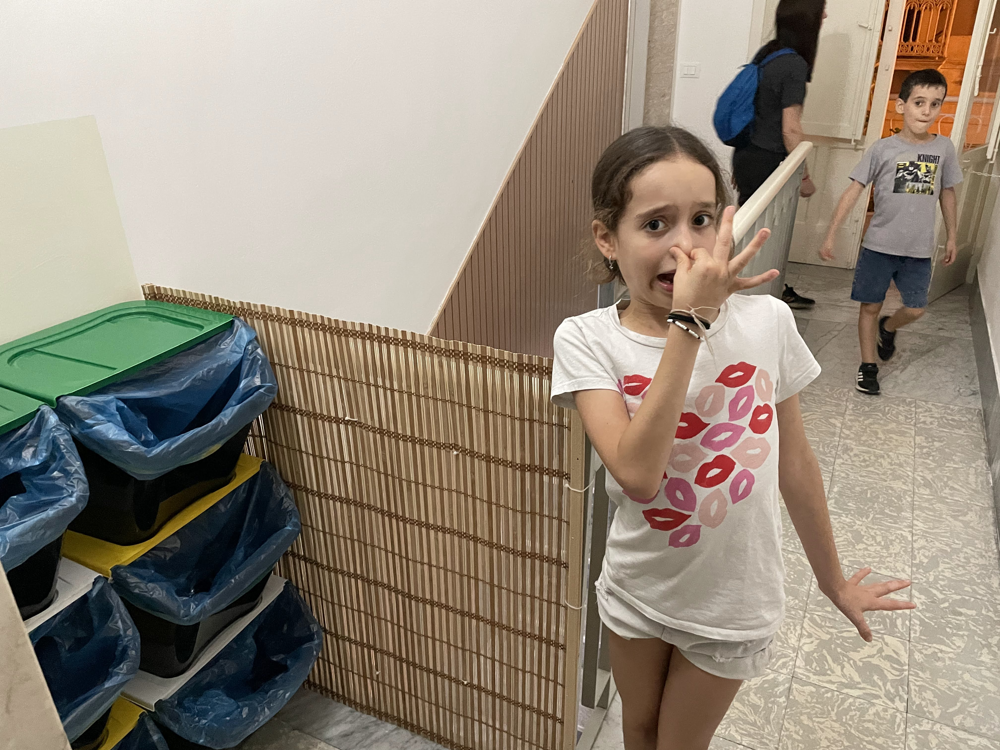

<link rel="stylesheet" href="https://unpkg.com/leaflet/dist/leaflet.css" />

תיירים בעיקר בזכות ההיסטוריה העשירה שלה. התמקמנו בדירה ששכרנו מ״אנטוניו החמור״ - איש נפלא עם המלצות שהוכיחו את עצמן. בכל פעם, לו הילדים התעקשו לקרוא ״החמור״ בלי שום סיבה. התלונה היחידה על הדירה היא שהפחים ממוקמים במסדרון מחוץ לדירה'' מה שאילץ אותנו להסתובב במסדרונות כך ולזמר:

<figure class="centered-img">
  
  <figcaption>"אל תשכח לסגור את האף ליד הפחים לייייד הפחיייים"</figcaption>
</figure>

